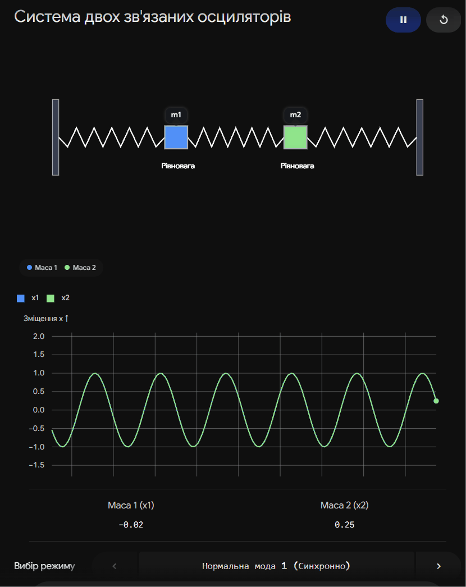
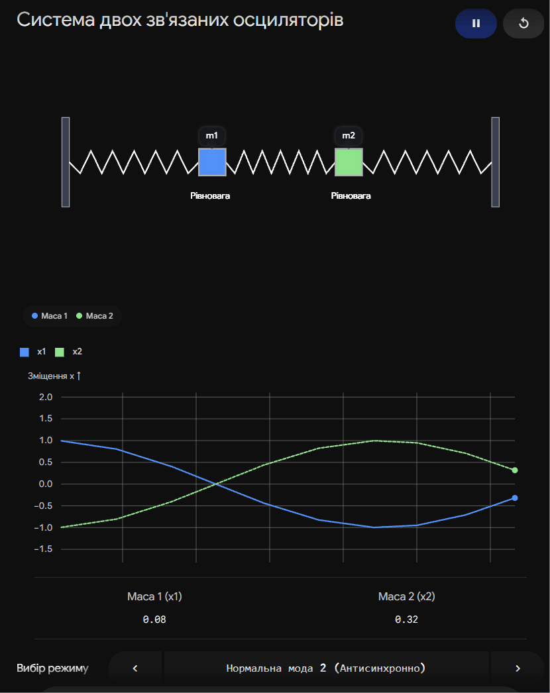
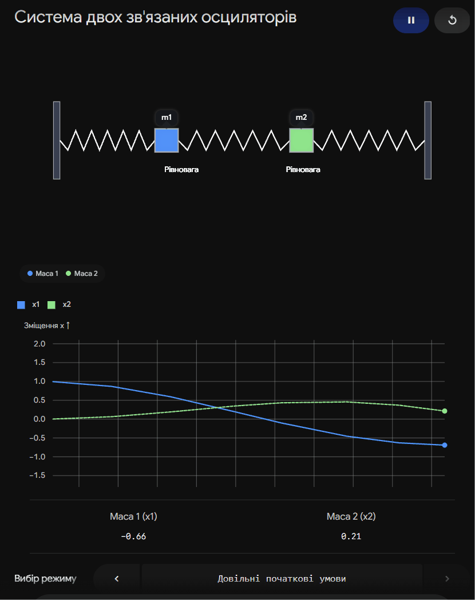

## 1. Малi коливання системи з f ступенями вiльностi.

### Ключова ідея

Малі коливання системи з багатьма ступенями вільності виникають, коли вона трохи відхиляється від стану стійкої рівноваги. Замість складного хаотичного руху взаємодіючих тіл, будь-яке мале коливання такої системи можна подати як суму (суперпозицію) незалежних простих гармонічних коливань — **нормальних мод**. Це дозволяє математично звести складну систему до набору звичайних незалежних "маятників".

---

### Розклад кінетичної та потенціальної енергії

Для системи з $f$ ступенями вільності положення задається узагальненими координатами $q_1, q_2, \dots, q_f$. Нехай стан стійкої рівноваги відповідає $q_i = 0$. Оскільки коливання малі, ми можемо розкласти енергії в ряд Тейлора і залишити лише перші ненульові члени (квадратичні).

**Потенціальна енергія ($U$):**
У стані рівноваги $U$ має мінімум, тому перші похідні дорівнюють нулю.

$$U = \frac{1}{2} \sum_{i,k=1}^f k_{ik} q_i q_k$$

Де $k_{ik} = \left. \frac{\partial^2 U}{\partial q_i \partial q_k} \right|_{q=0}$ — коефіцієнти квазіпружності (матриця жорсткості), що залежать від властивостей системи.

**Кінетична енергія ($T$):**
Оскільки швидкості $\dot{q}_i$ малі, коефіцієнти при них можна вважати сталими (обчисленими в точці рівноваги).

$$T = \frac{1}{2} \sum_{i,k=1}^f m_{ik} \dot{q}_i \dot{q}_k$$

Де $m_{ik}$ — коефіцієнти інерції (масова матриця).

### Рівняння руху та Секулярне рівняння

Функція Лагранжа для системи має вигляд $L = T - U$. Підставляючи її в рівняння Ейлера-Лагранжа, отримуємо систему з $f$ лінійних диференціальних рівнянь другого порядку:

$$\sum_{k=1}^f (m_{ik} \ddot{q}_k + k_{ik} q_k) = 0 \quad (i = 1, \dots, f)$$

Частинний розв'язок шукаємо у вигляді монохроматичного коливання однакової частоти $\omega$ для всіх координат:

$$q_k = A_k \cos(\omega t + \alpha)$$

Підстановка цього розв'язку дає систему алгебраїчних рівнянь для амплітуд $A_k$:

$$\sum_{k=1}^f (k_{ik} - \omega^2 m_{ik}) A_k = 0$$

Щоб ця система мала нетривіальний (ненульовий) розв'язок, її визначник має дорівнювати нулю. Це **характеристичне (секулярне) рівняння**:

$$\det(k_{ik} - \omega^2 m_{ik}) = 0$$

Розв'язавши це рівняння степеня $f$ відносно $\omega^2$, ми знайдемо $f$ коренів — **власних частот** системи ($\omega_1, \omega_2, \dots, \omega_f$).

### Нормальні координати

Щоб позбутися взаємозв'язку рівнянь, переходять до нових змінних — **нормальних координат** $\Theta_\alpha$. У цих координатах матриці маси та жорсткості стають діагональними.

| Характеристика      | Узагальнені координати ($q_i$)                                   | Нормальні координати ($\Theta_\alpha$)                                                                                                  |
| ------------------- | ---------------------------------------------------------------- | --------------------------------------------------------------------------------------------------------------------------------------- |
| **Фізичний зміст**  | Реальні відхилення елементів системи (напр., кути або зміщення). | Амплітуди незалежних типів рухів (нормальних мод).                                                                                      |
| **Взаємодія**       | Рух по одній координаті впливає на інші (зв'язані рівняння).     | Коливання відбуваються абсолютно незалежно одне від одного.                                                                             |
| **Рівняння руху**   | $\sum_k (m_{ik} \ddot{q}_k + k_{ik} q_k) = 0$                    | $\ddot{\Theta}_\alpha + \omega_\alpha^2 \Theta_\alpha = 0$                                                                              |
| **Енергія системи** | Містить перехресні доданки ($q_1 q_2$, $\dot{q}_1 \dot{q}_2$).   | Розпадається на суму енергій незалежних осциляторів ($T+U = \frac{1}{2}\sum(\dot{\Theta}_\alpha^2 + \omega_\alpha^2 \Theta_\alpha^2)$). |

Загальний рух системи є лінійною комбінацією (суперпозицією) нормальних коливань:

$$q_i(t) = \sum_{\alpha=1}^f C_{i\alpha} \Theta_\alpha(t)$$

---

### Підсумок

Завдяки розкладу енергій до квадратичних членів, аналіз малих коливань системи з $f$ ступенями вільності зводиться до розв'язання секулярного рівняння. Знайдені власні частоти та перехід до нормальних координат дозволяють представити складний рух як набір $f$ незалежних гармонічних осциляторів.

---

**Інтерактивна візуалізація для розуміння нормальних мод (на прикладі $f=2$)**
Ця симуляція допоможе сину наочно побачити різницю між хаотичним рухом в узагальнених координатах та чистими нормальними модами на прикладі двох зв'язаних візків.

