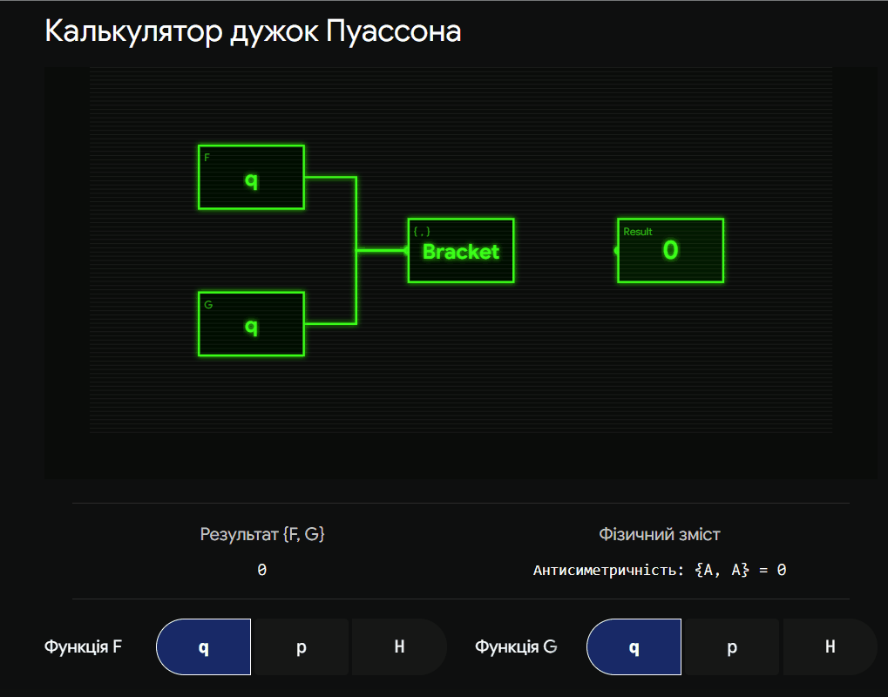
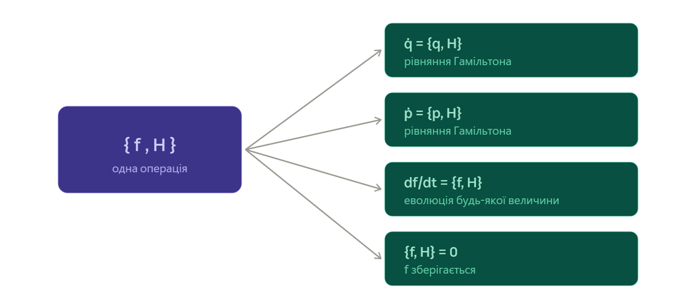

## 10. Дужки Пуассона та їх властивостi.

### Ключова ідея

Дужки Пуассона — це спеціальна математична операція у Гамільтоновій механіці, яка визначає, як будь-яка фізична величина (енергія, імпульс, координата) змінюється з часом під час руху системи у фазовому просторі. Цей елегантний алгебраїчний інструмент дозволяє знаходити інтеграли руху (величини, що зберігаються) та перевіряти канонічність перетворень без безпосереднього розв'язання диференціальних рівнянь.

---

### Визначення

Нехай $f(q, p, t)$ та $g(q, p, t)$ — дві довільні динамічні змінні (функції від координат $q_i$, імпульсів $p_i$ та часу $t$). **Дужками Пуассона** цих двох функцій називається вираз:

$$\{f, g\} = \sum_{i=1}^f \left( \frac{\partial f}{\partial q_i} \frac{\partial g}{\partial p_i} - \frac{\partial f}{\partial p_i} \frac{\partial g}{\partial q_i} \right)$$

де підсумовування ведеться по всіх $f$ ступенях вільності системи.

### Фундаментальні властивості

Дужки Пуассона мають чіткі алгебраїчні властивості, що робить їх схожими на операції диференціювання та комутатори у квантовій механіці (що є їхнім прямим аналогом).

1. **Антикомутативність:**

$$\{f, g\} = -\{g, f\}$$

Наслідок: дужка величини самої з собою дорівнює нулю: $\{f, f\} = 0$. 2. **Лінійність:**

$$\{c_1 f_1 + c_2 f_2, g\} = c_1\{f_1, g\} + c_2\{f_2, g\}$$

де $c_1, c_2$ — константи. 3. **Правило Лейбніца (диференціювання добутку):**

$$\{f_1 f_2, g\} = f_1\{f_2, g\} + \{f_1, g\}f_2$$

4. **Тотожність Якобі:**
   Для будь-яких трьох функцій $f, g, h$ виконується циклічна сума:

$$\{f, \{g, h\}\} + \{g, \{h, f\}\} + \{h, \{f, g\}\} = 0$$

### Фундаментальні (базові) дужки Пуассона

Якщо замість довільних функцій підставити самі канонічні змінні (координати $q$ та імпульси $p$), ми отримаємо базові співвідношення, які повністю визначають структуру фазового простору:

- $\{q_i, q_k\} = 0$
- $\{p_i, p_k\} = 0$
- $\{q_i, p_k\} = \delta_{ik}$ (де $\delta_{ik}$ — символ Кронекера: $1$, якщо $i=k$, і $0$, якщо $i \neq k$).

_Важливо:_ Будь-яке перетворення координат $(q, p) \to (Q, P)$ є канонічним тоді й лише тоді, коли нові змінні задовольняють ті самі фундаментальні дужки Пуассона ($\{Q_i, P_k\} = \delta_{ik}$).

### Рівняння руху та інтеграли руху

Повна похідна по часу від будь-якої фізичної величини $F(q, p, t)$ виражається через дужки Пуассона з Гамільтоніаном $H$:

$$\frac{dF}{dt} = \frac{\partial F}{\partial t} + \{F, H\}$$

З цього фундаментального рівняння випливають два надважливі наслідки:

1. **Рівняння Гамільтона:** Якщо підставити $F = q_i$ або $F = p_i$ (які не залежать від $t$ явно), ми миттєво отримуємо канонічні рівняння руху:
   $\dot{q}_i = \{q_i, H\} = \frac{\partial H}{\partial p_i}$
   $\dot{p}_i = \{p_i, H\} = -\frac{\partial H}{\partial q_i}$
2. **Інтеграли руху:** Якщо величина $F$ не залежить від часу явно ($\frac{\partial F}{\partial t} = 0$) і її дужка Пуассона з Гамільтоніаном дорівнює нулю ($\{F, H\} = 0$), то $\frac{dF}{dt} = 0$. Це означає, що **$F$ є інтегралом руху (зберігається з часом)**.
   _(Наприклад, якщо Гамільтоніан не залежить від $t$ явно, то $\{H, H\} = 0 \Rightarrow$ енергія зберігається)._

### Теорема Пуассона

Якщо $F_1$ та $F_2$ є двома інтегралами руху системи, то їхня дужка Пуассона $\{F_1, F_2\}$ також є інтегралом руху. Це дозволяє генерувати нові закони збереження з уже відомих.

---

### Підсумок

Дужки Пуассона перетворюють механіку на строгу алгебру. Вони дозволяють записувати рівняння руху в максимально компактній формі, елегантно знаходити величини, що зберігаються, і є прямим містком до квантової механіки (де дужки замінюються на комутатори операторів: $\{f, g\} \to \frac{1}{i\hbar}[\hat{f}, \hat{g}]$).

---

**Візуалізація: "Машина законів збереження" (Теорема Пуассона)**
Оскільки дужки Пуассона — це суто алгебраїчний інструмент, для кращого запам'ятовування пропоную згенерувати інтерактивну блок-схему (калькулятор), яка покаже механіку їх роботи. Син зможе обирати різні величини, а система показуватиме, чи зберігаються вони. Оскільки ти писав на асемблері, думаю, сину також зайде така логічна структура.

---

О, а оце — таємна **спільна мова** всього, що ми вже пройшли. Дужки Пуассона — це той апарат, яким рівняння Гамільтона, закони збереження й канонічні перетворення раптом починають говорити **однією короткою фразою**. І саме звідси відкриваються двері в квантову механіку. Розпаковую повільно.

## Крок 1. Що це за машина

Дужка Пуассона `{f, g}` — це операція, яка з'їдає **дві величини** (дві функції від координат і імпульсів) і видає **третю**. Для однієї координати формула така:

$$\{f, g\} = \frac{\partial f}{\partial q}\frac{\partial g}{\partial p} - \frac{\partial f}{\partial p}\frac{\partial g}{\partial q}$$

(для багатьох координат — просто сума таких доданків по всіх `i`).

Поки не питай «навіщо» — спершу відчуй, що це **просто рецепт**: візьми похідні `f` і `g` по `q` та `p`, перемнож навхрест, відніми. Виходить число (чи функція). А тепер найцікавіше — що ця штука **означає**.

## Крок 2. Серце теми: як змінюється будь-яка величина

Головна формула, заради якої все існує. Швидкість зміни **будь-якої** величини `f` під час руху системи дорівнює її дужці Пуассона з гамільтоніаном:

$$\frac{df}{dt} = \{f, H\}$$

(плюс `∂f/∂t`, якщо `f` явно залежить від часу — але зазвичай ні).

Це **одна формула, яка робить роботу всіх рівнянь руху одразу**. Дивись, як з неї випадає все, що ми вчили:Дивись, як одна дужка `{·, H}` робить роботу всіх рівнянь руху:

Перші дві плашки — це просто рівняння Гамільтона, переписані через дужки (перевір: `{q, H} = ∂H/∂p`, а `{p, H} = −∂H/∂q` — те саме, що ми вже знаємо). Третя — узагальнення на будь-яку величину. А четверта — те, заради чого ця тема золота.

## Крок 3. Критерій збереження — місток до Нетер

Подивись на останню плашку уважно. Якщо `{f, H} = 0`, то `df/dt = 0`, тобто **`f` зберігається**. Ось одне з найкрасивіших тверджень усієї механіки:

> **Величина зберігається тоді й тільки тоді, коли її дужка Пуассона з гамільтоніаном дорівнює нулю.**

Пам'ятаєш нашу першу тему — симетрії й закони збереження? Тепер у тебе є **алгебраїчний детектор**: щоб перевірити, чи щось зберігається, не треба нічого інтегрувати — просто порахуй `{f, H}` і подивись, чи вийшов нуль. Симетрія, збережена величина і `{f, H} = 0` — це три обличчя однієї істини.

## Крок 4. Генератори: чому це не випадковість

Є ще глибший шар. Дужка `{f, g}` показує, **як змінюється `f`, коли система «тече» вздовж `g`**. Тобто кожна величина — це **генератор** якогось руху у фазовому просторі:

- `H` генерує **зсув у часі** → тому `{f, H}` = зміна `f` з часом;
- імпульс `p` генерує **зсув у просторі** → `{f, p}` = зміна `f` при зсуві;
- момент імпульсу генерує **поворот**.

Помічаєш, що сталось? **Збережена величина — це генератор тієї самої симетрії, що її породжує.** Енергія ↔ зсув у часі, імпульс ↔ зсув у просторі, момент ↔ поворот. Уся наша перша тема про Нетер тут зашита в один рядок. Коло замкнулось ще раз.

## Крок 5. Властивості (те, що питатимуть прямо)

Дужки Пуассона поводяться за чіткими правилами:

1. **Антисиметрія:** `{f, g} = −{g, f}`. Звідси одразу `{f, f} = 0`.
2. **Лінійність:** `{af + bg, h} = a{f,h} + b{g,h}`.
3. **Правило Лейбніца** (як похідна добутку): `{fg, h} = f{g,h} + {f,h}g`.
4. **Тотожність Якобі:** `{f,{g,h}} + {g,{h,f}} + {h,{f,g}} = 0`.
5. **Зі сталою:** `{f, const} = 0`.

І окремо — **фундаментальні дужки**, це наче таблиця множення цієї алгебри:

$$\{q_i, q_j\} = 0, \qquad \{p_i, p_j\} = 0, \qquad \{q_i, p_j\} = \delta_{ij}$$

(для однієї координати просто `{q, p} = 1`).

## Крок 6. Несподіваний бонус — тест на канонічність

Згадай минулу тему: ми мучились, перевіряючи, чи перетворення канонічне. Так от — дужки Пуассона дають **миттєвий тест**. Перетворення `(q,p) → (Q,P)` канонічне тоді й тільки тоді, коли нові змінні зберігають ті самі фундаментальні дужки:

$$\{Q_i, Q_j\} = 0, \qquad \{P_i, P_j\} = 0, \qquad \{Q_i, P_j\} = \delta_{ij}$$

Порахував три дужки — і знаєш відповідь. Жодного інтегрування.

Ще є **теорема Пуассона**: якщо `f` і `g` обидві зберігаються, то й `{f, g}` зберігається. Тобто з двох відомих інтегралів руху можна **народжувати нові** — інколи так знаходять приховані збереження.

## Крок 7. І найголовніше — двері в квантову механіку

Ось чому ця тема — не просто формалізм. У квантовій механіці дужка Пуассона **перетворюється на комутатор**:

$$\{f, g\} \;\longrightarrow\; \frac{1}{i\hbar}\,[\hat f, \hat g]$$

А фундаментальна дужка `{q, p} = 1` стає найзнаменитішим рівнянням квантів:

$$[\hat x, \hat p] = i\hbar$$

Тобто **принцип невизначеності Гайзенберга виростає прямо з дужки Пуассона**. Класична механіка й квантова — це одна алгебра, лише з різними «множниками». Для астрофізика, який житиме між зорями (класика) і їхнім випромінюванням (кванти), це фундаментальний місток.

---

Тобто дужки Пуассона — це **спільна граматика** всього курсу: рівняння руху, збереження, канонічність і навіть квантовка — усе це одна операція в різних костюмах.

---

# Дужки Пуассона та їх властивості

**Шпаргалка на захист.** Одне означення, одна головна формула, список властивостей, місток у кванти.

---

## Означення

Дужка Пуассона двох величин `f(q,p)` і `g(q,p)`:

$$\{f, g\} = \sum_i\left(\frac{\partial f}{\partial q_i}\frac{\partial g}{\partial p_i} - \frac{\partial f}{\partial p_i}\frac{\partial g}{\partial q_i}\right)$$

Для однієї координати: `{f, g} = ∂f/∂q · ∂g/∂p − ∂f/∂p · ∂g/∂q`.

Зміст: `{f, g}` показує, як змінюється `f`, коли система «тече» вздовж `g`. Кожна величина — генератор якогось руху (`H` → зсув у часі, `p` → зсув у просторі, момент → поворот).

---

## Головна формула: еволюція будь-якої величини

$$\frac{df}{dt} = \{f, H\} + \frac{\partial f}{\partial t}$$

(останній доданок — лише якщо `f` явно залежить від часу). З неї випадає все:

- `\dot q = \{q, H\} = \partial H/\partial p` — рівняння Гамільтона;
- `\dot p = \{p, H\} = -\partial H/\partial q` — рівняння Гамільтона;
- **критерій збереження:** `f` зберігається `⟺ {f, H} = 0`.

> Збереження не треба інтегрувати — порахуй `{f, H}` і подивись, чи нуль.

---

## Властивості (питатимуть прямо)

| Властивість      | Формула                                 |
| ---------------- | --------------------------------------- |
| Антисиметрія     | `{f, g} = −{g, f}`, звідси `{f, f} = 0` |
| Лінійність       | `{af + bg, h} = a{f,h} + b{g,h}`        |
| Правило Лейбніца | `{fg, h} = f{g,h} + {f,h}g`             |
| Тотожність Якобі | `{f,{g,h}} + {g,{h,f}} + {h,{f,g}} = 0` |
| Зі сталою        | `{f, const} = 0`                        |

---

## Фундаментальні дужки («таблиця множення»)

$$\{q_i, q_j\} = 0, \qquad \{p_i, p_j\} = 0, \qquad \{q_i, p_j\} = \delta_{ij}$$

Для однієї координати: `{q, p} = 1`.

---

## Бонус 1: тест на канонічність

Перетворення `(q,p) → (Q,P)` **канонічне ⟺** нові змінні зберігають фундаментальні дужки:

$$\{Q_i, Q_j\} = 0, \quad \{P_i, P_j\} = 0, \quad \{Q_i, P_j\} = \delta_{ij}$$

Порахував три дужки — маєш відповідь, без інтегрування.

## Бонус 2: теорема Пуассона

Якщо `f` і `g` зберігаються, то й `{f, g}` зберігається. → з двох інтегралів руху можна народжувати нові.

---

## Місток у квантову механіку

Дужка Пуассона стає комутатором:

$$\{f, g\} \;\longrightarrow\; \frac{1}{i\hbar}[\hat f, \hat g]$$

Фундаментальна `{q, p} = 1` стає каноном квантів:

$$[\hat x, \hat p] = i\hbar$$

Звідси виростає принцип невизначеності. Класика й кванти — одна алгебра з різним множником.

---

## Фрази для захисту (вивчити дослівно)

- «Дужка Пуассона — це білінійна антисиметрична операція над функціями фазового простору, що задовольняє тотожність Якобі.»
- «Еволюція будь-якої величини: `df/dt = {f, H}`; звідси рівняння Гамільтона і критерій збереження `{f, H} = 0`.»
- «Фундаментальні дужки: `{q_i, p_j} = δ_ij`, решта нулі; їх збереження — критерій канонічності перетворення.»
- «Теорема Пуассона: дужка двох інтегралів руху — теж інтеграл руху.»
- «При квантуванні `{f, g} → [f̂, ĝ]/iℏ`, а `{q, p} = 1` переходить у `[x̂, p̂] = iℏ`.»

---

_Якщо панікуєш: дужка = «навхрест похідні по `q` і `p`, відняти». Усе інше — наслідки формули `df/dt = {f, H}`._
