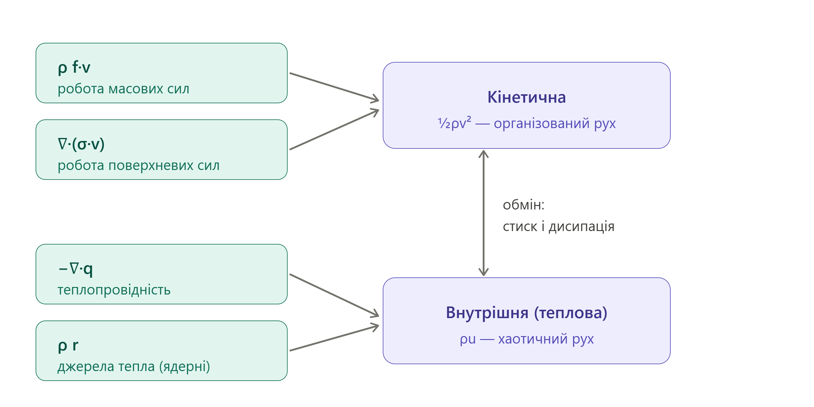

# 15. Рiвняння балансу енергiї

**Ключова ідея:** Рівняння балансу енергії для суцільного середовища є фундаментальним математичним виразом першого закону термодинаміки у поєднанні із законом збереження механічної енергії. Воно встановлює, що швидкість зміни повної енергії (суми кінетичної та внутрішньої) виділеного об'єму дорівнює сумарній потужності зовнішніх сил (масових і поверхневих), що діють на цей об'єм, та швидкості надходження тепла через його межі.

## Інтегральна форма рівняння

Для довільного рухомого (матеріального) об'єму $V$, обмеженого поверхнею $S$, закон збереження енергії записується так:

$$\frac{d}{dt} \int_V \rho \left( \frac{v^2}{2} + \varepsilon \right) dV = \int_V \rho \vec{f} \cdot \vec{v} dV + \oint_S (\hat{\sigma} \cdot \vec{n}) \cdot \vec{v} dS - \oint_S \vec{q} \cdot \vec{n} dS$$

**Пояснення змінних:**

- $\rho$ — густина середовища.
- $v$ — модуль вектора швидкості $\vec{v}$ (швидкість макроскопічного руху).
- $\varepsilon$ — питома внутрішня енергія (енергія хаотичного теплового руху молекул та міжмолекулярної взаємодії в розрахунку на одиницю маси).
- $\vec{f}$ — масова (об'ємна) сила, що діє на одиницю маси (наприклад, $\vec{g}$).
- $\hat{\sigma}$ — тензор механічних напруг (описує сили тиску та в'язкого тертя).
- $\vec{n}$ — одиничний вектор зовнішньої нормалі до поверхні.
- $\vec{q}$ — вектор густини теплового потоку (кількість теплоти, що проходить через одиницю площі за одиницю часу).

## Диференціальна форма рівняння

Застосовуючи теорему Гауса-Остроградського до поверхневих інтегралів та враховуючи рівняння неперервності, отримуємо рівняння у диференціальній формі (для локальної точки середовища):

$$\rho \frac{d}{dt} \left( \frac{v^2}{2} + \varepsilon \right) = \rho \vec{f} \cdot \vec{v} + \nabla \cdot (\hat{\sigma} \cdot \vec{v}) - \nabla \cdot \vec{q}$$

### Аналіз складових енергетичного балансу

| Складова рівняння                  | Математичний вираз                                | Фізичний зміст                                                                                                        |
| ---------------------------------- | ------------------------------------------------- | --------------------------------------------------------------------------------------------------------------------- |
| **Швидкість зміни повної енергії** | $\rho \frac{d}{dt} (\frac{v^2}{2} + \varepsilon)$ | Локальна зміна суми кінетичної та внутрішньої енергії одиниці об'єму середовища з часом.                              |
| **Потужність масових сил**         | $\rho \vec{f} \cdot \vec{v}$                      | Механічна робота, яку виконують зовнішні об'ємні сили (наприклад, гравітація) за одиницю часу.                        |
| **Потужність поверхневих сил**     | $\nabla \cdot (\hat{\sigma} \cdot \vec{v})$       | Робота внутрішніх сил напруги (тиск, в'язке тертя) на межах частинки, яка спричиняє макроскопічний рух та деформацію. |
| **Приплив тепла**                  | $-\nabla \cdot \vec{q}$                           | Кількість теплової енергії, що надходить у точку середовища (або відводиться з неї) за рахунок теплопровідності.      |

## Рівняння припливу тепла (баланс внутрішньої енергії)

Якщо від рівняння повної енергії відняти рівняння балансу суто механічної енергії (кінетичної), ми отримаємо рівняння, що описує виключно зміну **внутрішньої енергії** (рівняння припливу тепла):

$$\rho \frac{d\varepsilon}{dt} = \hat{\sigma} : \hat{D} - \nabla \cdot \vec{q}$$

**Пояснення змінних:**

- $\hat{D}$ — тензор швидкостей деформації.
- $\hat{\sigma} : \hat{D}$ — подвійний скалярний добуток тензорів. Це потужність внутрішніх сил, що йде на зміну об'єму та форми частинки (включає необоротну дисипацію механічної енергії у тепло через в'язкість — дисипативну функцію Релея).

**Висновок:** Рівняння балансу енергії розкриває механізми взаємоперетворення різних видів енергії у суцільному середовищі. Воно показує, що зміна енергетичного стану системи нерозривно пов'язана з виконанням механічної роботи силами напруг та масовими силами, а також з процесами теплообміну (теплопровідністю, радіацією чи внутрішніми джерелами тепла).
[Динаміка балансу енергії суцільного середовища](code_artifact15.html)

---

А ось і третій великий закон збереження поспіль. Спершу була маса (неперервність), потім імпульс (Коші/Ейлер) — тепер **енергія**. По суті це **перший закон термодинаміки для рухомого середовища**, і саме він з'єднує ядерну піч у надрах зорі зі світлом, яке ти бачиш у телескоп. Розпаковую повільно.

## Крок 1. У континууму два «гаманці» енергії

Енергія шматочка середовища складається з двох частин:

- **кінетична** — енергія **організованого** макроскопічного руху, `\tfrac{1}{2}v^2` на одиницю маси;
- **внутрішня** — енергія **хаотичного** мікроскопічного руху молекул (тепло), `u` на одиницю маси.

Повна питома енергія — це `\tfrac{1}{2}v^2 + u`. Уся тема — про те, як ці два гаманці поповнюються, спорожнюються й **перетікають один в одного**.

## Крок 2. Сама ідея балансу

Принцип той самий, що з масою, але з добавкою: енергія шматочка змінюється тільки через **роботу**, яку над ним виконують сили, плюс **тепло**, яке до нього притікає чи в ньому народжується. Це й є перший закон термодинаміки, записаний для елемента, що рухається.

## Крок 3. Головне рівняння

У консервативній формі рівняння балансу енергії виглядає так:

$$\frac{\partial}{\partial t}\!\left[\rho\!\left(\tfrac{1}{2}v^2 + u\right)\right] + \nabla\cdot\!\left[\rho\!\left(\tfrac{1}{2}v^2 + u\right)\vec v\right] = \rho\,\vec f\cdot\vec v + \nabla\cdot(\sigma\cdot\vec v) - \nabla\cdot\vec q + \rho r$$

Не лякайся довжини — придивись до **лівої** частини: це ж рівно форма рівняння неперервності з минулої теми, тільки густина тепер **енергетична**, а не масова! `\partial(\text{густина енергії})/\partial t + \nabla\cdot(\text{потік енергії}) = \text{джерела}`. А права частина — це і є джерела/робота. Розкладемо їх по поличках:

Ліворуч — чотири «крани», що поповнюють енергію: робота масових сил, робота поверхневих сил, тепло від теплопровідності й внутрішні джерела (для зорі — ядерний синтез). А посередині — стрілка обміну: два гаманці **перетікають один в одного**.

## Крок 4. Як кінетична перетворюється на внутрішню

Якщо помножити рівняння руху Коші скалярно на `\vec v`, дістанемо окреме рівняння для **кінетичної** енергії. У ньому виринає особливий член — `\sigma_{ij}\,\partial v_i/\partial x_j`, **деформаційна робота**. Це і є той «курс обміну» між двома гаманцями. Для рідини він розпадається на дві частини:

- `-p\,\nabla\cdot\vec v` — **робота стиску** (оборотна: стиснув — нагрів, розширив — охолодив);
- `\Phi \ge 0` — **в'язка дисипація** (необоротна: завжди перетворює рух на тепло).

Ключовий момент: дисипація `\Phi` **завжди невід'ємна**. Організований рух може вільно перетворюватися на тепло (тертя гріє), але назад — ні. Це і є другий закон термодинаміки, що ховається тут.

## Крок 5. Рівняння внутрішньої енергії — перший закон у чистому вигляді

Якщо лишити тільки тепловий гаманець, отримуємо рівняння для **внутрішньої** енергії (для рідини):

$$\rho\,\frac{Du}{Dt} = -p\,\nabla\cdot\vec v + \Phi - \nabla\cdot\vec q + \rho r$$

Прочитай його як перший закон термодинаміки `du = \delta q - p\,dV` для рухомого елемента: внутрішня енергія росте від **стиску** (`-p\nabla\cdot\vec v`), **в'язкого тертя** (`\Phi`), **притоку тепла** (`-\nabla\cdot\vec q`) і **джерел** (`\rho r`).
_Образ:_ накачуєш шину насосом — він теплішає (стиск); тереш долоні — теплішають (дисипація).

## Крок 6. Твій астрофізичний джекпот

- **Рівняння будови зорі.** Член `\rho r` — це ядерне енерговиділення в центрі, а `-\nabla\cdot\vec q` — винесення енергії випромінюванням. Їхній баланс дає рівняння світності `dL/dr = 4\pi r^2 \rho\,\varepsilon` — буквально те, що визначає, скільки світла випромінює зоря.
- **Ударні хвилі (наднові).** На фронті удару кінетична енергія різко переходить у внутрішню — газ розжарюється й світиться. Це деформаційна робота в дії.
- **Акреційні диски.** Уся світність диска — це **в'язка дисипація** `\Phi`: тертя в газі, що по спіралі падає на зорю, перетворює гравітаційну енергію на тепло й світло, яке ми реєструємо.
- **Стаціонарна ідеальна течія** дає **рівняння Бернуллі** — збереження енергії вздовж лінії току.

---

Підсумок: рівняння балансу енергії — це **перший закон термодинаміки для рухомого середовища**. Повна енергія (кінетична + внутрішня) міняється лише через роботу сил і притік тепла; а між двома гаманцями йде обмін через стиск (оборотний) і дисипацію (необоротну). У формі це знову балансне рівняння —
$$\frac{\partial \rho}{\partial t} + \nabla \cdot \vec{j} = S$$

---

# Рівняння балансу енергії

**Шпаргалка на захист.** Перший закон термодинаміки для рухомого середовища: два гаманці енергії, робота й тепло.

---

## Два гаманці енергії

Питома повна енергія = кінетична + внутрішня:

$$e = \tfrac{1}{2}v^2 + u$$

- `½v²` — **кінетична** (організований макроскопічний рух);
- `u` — **внутрішня** (хаотичний мікроскопічний рух молекул, тепло).

---

## Головне рівняння (повна енергія)

Консервативна форма:

$$\frac{\partial}{\partial t}\!\left[\rho\!\left(\tfrac{1}{2}v^2 + u\right)\right] + \nabla\cdot\!\left[\rho\,e\,\vec v\right] = \rho\,\vec f\cdot\vec v + \nabla\cdot(\sigma\cdot\vec v) - \nabla\cdot\vec q + \rho r$$

Ліворуч — балансна форма (як неперервність, але для енергії). Праворуч — джерела:

- `ρ\vec f·\vec v` — потужність масових сил;
- `∇·(σ·\vec v)` — потужність поверхневих сил;
- `−∇·\vec q` — притік тепла (теплопровідність);
- `ρ r` — внутрішні джерела (ядерні, радіація).

---

## Обмін між гаманцями

Помноживши рівняння Коші на `\vec v`, дістаємо рівняння **кінетичної** енергії. У ньому член деформаційної роботи `σ_ij\,∂v_i/∂x_j` — це «курс обміну» з внутрішньою. Для рідини він =

$$-p\,\nabla\cdot\vec v \;+\; \Phi$$

- `−p∇·\vec v` — **робота стиску** (оборотна: стиснув → нагрів);
- `Φ ≥ 0` — **в'язка дисипація** (необоротна: рух → тепло, завжди).

`Φ ≥ 0` — це другий закон: організований рух вільно стає теплом, назад — ні.

---

## Рівняння внутрішньої енергії (перший закон)

$$\rho\,\frac{Du}{Dt} = -p\,\nabla\cdot\vec v + \Phi - \nabla\cdot\vec q + \rho r$$

Це `du = δq − p\,dV` для рухомого елемента: внутрішня енергія росте від стиску, тертя, притоку тепла й джерел.

_Образ:_ насос гріється (стиск); долоні гріються від тертя (дисипація).

---

## Застосування

| Галузь                     | Роль                                                                |
| -------------------------- | ------------------------------------------------------------------- |
| Будова зорі                | `ρr` (ядерні) проти `−∇·\vec q` (випромінювання) → `dL/dr = 4πr²ρε` |
| Ударні хвилі (наднові)     | кінетична → внутрішня: газ розжарюється                             |
| Акреційні диски            | в'язка дисипація `Φ` → світність, яку ми бачимо                     |
| Стаціонарна ідеальна течія | рівняння Бернуллі (енергія вздовж лінії току)                       |

---

## Фрази для захисту (вивчити дослівно)

- «Повна енергія елемента = кінетична `½v²` плюс внутрішня `u`; її баланс — перший закон термодинаміки для рухомого середовища.»
- «Зміна енергії = потужність масових і поверхневих сил плюс притік тепла й джерела.»
- «Деформаційна робота `σ_ij ∂v_i/∂x_j` обмінює кінетичну й внутрішню: оборотний стиск `−p∇·\vec v` плюс необоротна дисипація `Φ ≥ 0`.»
- «Рівняння внутрішньої енергії `ρ Du/Dt = −p∇·\vec v + Φ − ∇·\vec q + ρr` — це `du = δq − p dV`.»

---

_Якщо панікуєш: це `dE/dt = робота + тепло`. Два гаманці (рух і тепло) обмінюються через стиск (туди-сюди) і тертя (тільки в тепло)._
