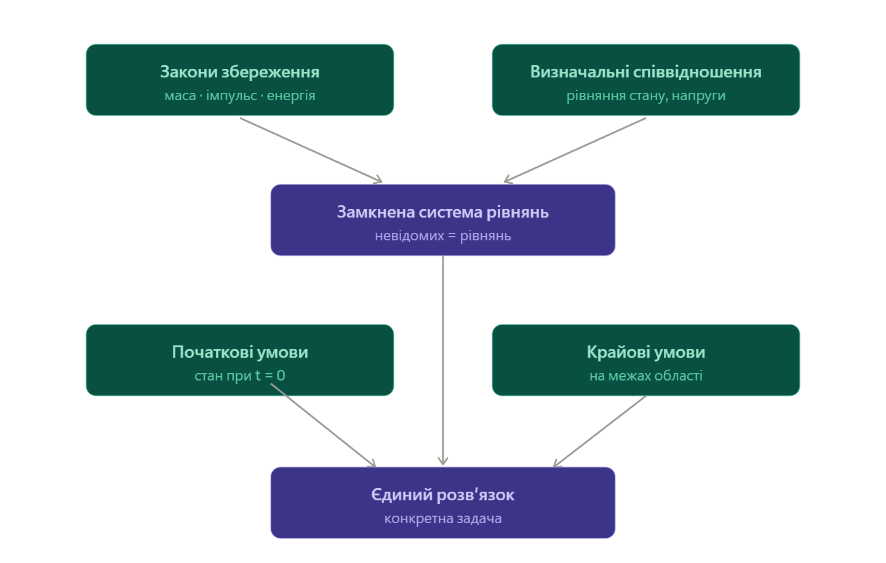

# 16. Повна система рівнянь руху суцільного середовища. Крайові та початкові умови

**Ключова ідея:** Повна система рівнянь суцільного середовища об'єднує фундаментальні закони збереження маси, імпульсу та енергії із замикаючими термодинамічними й реологічними співвідношеннями для повного опису стану системи в будь-якій точці простору і часу. Оскільки диференціальні рівняння описують загальний клас рухів, для знаходження єдиного розв'язку конкретної задачі обов'язково задаються початкові умови (стан середовища у вихідний момент часу) та крайові умови (фізичні обмеження на межах середовища).

## Повна система диференціальних рівнянь

Загальна замкнена система рівнянь механіки суцільних середовищ у диференціальній формі (Ейлерові змінні) складається з таких основних законів:

1. **Рівняння неперервності (закон збереження маси):**

$$\frac{\partial \rho}{\partial t} + \nabla \cdot (\rho \vec{v}) = 0$$

2. **Рівняння руху Коші (закон збереження імпульсу):**

$$\rho \left( \frac{\partial \vec{v}}{\partial t} + (\vec{v} \cdot \nabla)\vec{v} \right) = \rho \vec{f} + \nabla \cdot \hat{\sigma}$$

3. **Рівняння балансу енергії (закон збереження енергії):**

$$\rho \frac{d}{dt} \left( \frac{v^2}{2} + \varepsilon \right) = \rho \vec{f} \cdot \vec{v} + \nabla \cdot (\hat{\sigma} \cdot \vec{v}) - \nabla \cdot \vec{q}$$

### Замикаючі (визначальні) рівняння

Кількість невідомих у перших трьох рівняннях перевищує кількість самих рівнянь. Для замикання системи додаються:

- **Рівняння стану (термодинамічні):** що пов’язують тиск $p$ та внутрішню енергію $\varepsilon$ з густиною $\rho$ та температурою $T$. Наприклад, для ідеального газу: $p = \rho R T$.
- **Реологічні рівняння:** що пов’язують тензор механічних напруг $\hat{\sigma}$ з деформаціями або швидкостями деформацій. Наприклад, закон лінійного в'язкого тертя Ньютона: $\hat{\sigma} = -p\hat{I} + \hat{\tau}(\hat{D})$.
- **Закон теплопровідності (Фур'є):** для вектора густини теплового потоку: $\vec{q} = -\varkappa \nabla T$.

---

## Початкові та крайові умови

Диференціальні рівняння визначають поведінку середовища «в малому». Щоб отримати розв'язок для конкретного об'єкта (наприклад, обтікання крила літака чи коливання затиснутого стержня), систему доповнюють умовами однозначності.

### Початкові умови

Задають стан середовища в усьому досліджуваному об'ємі $V$ у початковий момент часу ($t = 0$):

- Поле швидкостей: $\vec{v}(\vec{r}, 0) = \vec{v}_0(\vec{r})$
- Поле густини: $\rho(\vec{r}, 0) = \rho_0(\vec{r})$
- Поле температури: $T(\vec{r}, 0) = T_0(\vec{r})$

### Крайові (граничні) умови

Задають фізичний режим на замкненій поверхні (межі) середовища $S$ для всього проміжку часу $t > 0$. Вони поділяються на кілька типів залежно від моделі середовища:

| Тип середовища / межі                   | Кінематичні крайові умови                                                                                                                                        | Динамічні крайові умови                                                                                                                                                        |
| --------------------------------------- | ---------------------------------------------------------------------------------------------------------------------------------------------------------------- | ------------------------------------------------------------------------------------------------------------------------------------------------------------------------------ |
| **Ідеальна рідина** (на твердій стінці) | **Умова непротікання:** Нормальна складова швидкості рідини дорівнює швидкості стінки: $v_n = \vec{v} \cdot \vec{n} = 0$. Проковзування вздовж стінки дозволене. | —                                                                                                                                                                              |
| **В'язка рідина** (на твердій стінці)   | **Умова прилипання:** Повний вектор швидкості рідини на межі дорівнює швидкості стінки: $\vec{v} = \vec{v}_{\text{wall}} = 0$.                                   | —                                                                                                                                                                              |
| **Вільна поверхня рідини**              | Межа рухається разом із поверхневими частинками: $\frac{dF(\vec{r},t)}{dt} = 0$.                                                                                 | Тиск на поверхні дорівнює зовнішньому тиску: $p = p_{\text{ext}}$ (або враховує капілярний натяг: $\Delta p = \frac{2\alpha}{R}$).                                             |
| **Пружне тверде тіло**                  | **Жорстке закріплення:** Зміщення точок межі фіксовані або дорівнюють нулю: $\vec{u} = 0$.                                                                       | **Навантажена/вільна поверхня:** Задано вектор зовнішніх зусиль $\vec{P}$: $\hat{\sigma} \cdot \vec{n} = \vec{P}$ (якщо поверхня вільна, то $\hat{\sigma} \cdot \vec{n} = 0$). |

**Висновок:** Повна система рівнянь руху відображає фундаментальну єдність законів збереження та індивідуальних властивостей конкретного матеріалу. Початкові та крайові умови є математичним інструментом, що виділяє з нескінченної множини математичних розв'язків єдиний реальний фізичний процес, який відповідає заданій постановці експерименту.
[Демонстрація крайових умов у гідродинаміці](code_artifact16.html)

---

Це **капстоун** усього блоку про суцільне середовище — тут ми збираємо все, що вивели за останні теми, докупи. І по дорозі натрапляємо на сюрприз: самих законів збереження **не вистачає**, щоб задача розв'язалась. Розпаковую повільно.

## Крок 1. Що ми вже маємо на руках

За попередні теми ми вивели три закони збереження — це і є кістяк руху середовища:

- **маса** (неперервність): `\partial\rho/\partial t + \nabla\cdot(\rho\vec v) = 0` — 1 рівняння;
- **імпульс** (Коші/Ейлер): `\rho\, D\vec v/Dt = \rho\vec f + \nabla\cdot\sigma` — 3 рівняння (вектор);
- **енергія** (баланс): `\rho\, De/Dt = \dots` — 1 рівняння.

Разом — **5 скалярних рівнянь**. Здавалося б, усе. Але порахуймо невідомі.

## Крок 2. Проблема замикання

Невідомі: густина `\rho` (1), швидкість `\vec v` (3), тиск/напруги `p`, температура `T`, тепловий потік `\vec q`… Виходить **більше невідомих, ніж рівнянь**. Система **незамкнена** — її неможливо розв'язати в такому вигляді.

Чому так? Бо закони збереження **універсальні, але не знають, з яким матеріалом мають справу**. Вони однакові для повітря, води, сталі й зоряної плазми. Їм бракує інформації про **властивості конкретної речовини**.

## Крок 3. Визначальні співвідношення — «характер» матеріалу

Бракує **визначальних співвідношень** (рівнянь стану) — вони описують, як конкретна речовина реагує на стиск, зсув і нагрів:

- **рівняння стану:** `p = p(\rho, T)` (ідеальний газ `p = \rho R T/\mu`, політропа `p = K\rho^\gamma`);
- **закон напруг:** для рідини `\sigma_{ij} = -p\delta_{ij} + \mu(\dots)` (в'язкість), для твердого тіла — закон Гука;
- **закон теплопровідності Фур'є:** `\vec q = -k\nabla T`;
- **калорійне співвідношення:** `u = u(T)` (напр. `u = c_v T`).

_Алегорія:_ закони збереження — це правила бухгалтерії, спільні для **будь-якого** бізнесу. Але щоб передбачити конкретну компанію, треба знати її **бізнес-модель**. Визначальні співвідношення — це й є «бізнес-модель» матеріалу. Додавши їх, ми зрівнюємо число рівнянь і невідомих — система **замикається**.

## Крок 4. Але й замкненої системи замало

Замкнена система рівнянь усе ще має **безліч розв'язків** — поки ми не скажемо, **де починати** і **що на краях**. Подивись на повну архітектуру:

Зверху — універсальні закони збереження плюс «характер» матеріалу; разом вони дають замкнену систему. Але щоб дійти до **єдиного розв'язку конкретної задачі**, треба ще дві речі знизу — початкові й крайові умови. Розберемо їх.

## Крок 5. Повна замкнена система (приклад для ідеальної рідини)

Зібравши все, для нев'язкого газу маємо таку повну систему:

- неперервність: `\partial\rho/\partial t + \nabla\cdot(\rho\vec v) = 0`;
- Ейлер: `\rho\, D\vec v/Dt = \rho\vec f - \nabla p`;
- енергія / ентропія: напр. `Ds/Dt = 0` (адіабата);
- рівняння стану: `p = p(\rho, s)`.

Тепер рівнянь рівно стільки, скільки невідомих (`\rho`, три компоненти `\vec v`, `p`). Система **розв'язна** — але має ще безліч розв'язків.

## Крок 6. Чому потрібні умови — алегорія кіно

Замкнена система рівнянь — це **правила фізики**, які кажуть, **як один момент випливає з попереднього**. Але самих правил замало, щоб зняти конкретний фільм. Потрібні ще:

- **початковий кадр** — звідки все стартує (початкові умови);
- **краї екрана / стіни знімального павільйону** — що відбувається на межах увесь час (крайові умови).

Без них правила дають **усі можливі фільми** одразу. Умови вибирають **один**.

## Крок 7. Початкові умови

Задають **стан усього поля в момент `t = 0`**: де яка густина `\rho(\vec r, 0)`, швидкість `\vec v(\vec r, 0)`, температура `T(\vec r, 0)`. Оскільки рівняння першого порядку за часом, їм потрібен лише стартовий знімок — далі вони самі котять його вперед. (Як Ньютону треба початкові координату й швидкість.)

## Крок 8. Крайові умови

Задають, що діється на **межах області** весь час. Основні типи:

- **кінематичні** (на швидкість): на твердій стінці — **непротікання** `\vec v\cdot\vec n = 0` (рідина не тече крізь стіну); для **в'язкої** рідини додається **прилипання** `\vec v = \vec v_{\text{стінки}}` (і дотична складова нульова). Вільна поверхня рухається разом із рідиною.
- **динамічні** (на напруги): на межі чи вільній поверхні **вектор напруги неперервний** — тиск дорівнює зовнішньому або врівноважений поверхневим натягом.
- **теплові**: задана **температура** `T` (умова Діріхле) або **тепловий потік** `\vec q\cdot\vec n` (умова Неймана; ізоляція → `\vec q\cdot\vec n = 0`).
- **на нескінченності**: поля прямують до відомих значень (однорідна течія вдалині, згасання збурень).

## Крок 9. Твій астрофізичний джекпот — будова зорі

Класичний приклад повної замкненої задачі — **модель зорі**. Чотири рівняння будови (гідростатична рівновага, збереження маси, перенесення енергії, енерговиділення) + рівняння стану речовини, замкнені **крайовими умовами**:

- у **центрі**: маса `m = 0` і світність `L = 0`;
- на **поверхні**: тиск `p \to 0` і температура `T = T_{\text{еф}}`.

Розв'язуєш цю крайову задачу — і отримуєш повний профіль зорі: як міняються тиск, температура й густина від центру до поверхні. Це і є те, як астрофізики «рахують» зорі.

---

Підсумок: **повна система** = закони збереження (маса + імпульс + енергія) **плюс** визначальні співвідношення, що замикають її під конкретний матеріал. А щоб виокремити єдиний розв'язок, додаєш **початкові умови** (стартовий знімок) і **крайові умови** (поведінку на межах). Без замикання система недовизначена; без умов — має безліч розв'язків.

---

# Повна система рівнянь руху. Крайові та початкові умови

**Шпаргалка на захист.** Закони збереження самі не замикаються — треба матеріал; а щоб був єдиний розв'язок — умови.

---

## Що маємо: закони збереження (5 рівнянь)

- маса: $\dfrac{\partial \rho}{\partial t} + \nabla\cdot(\rho\vec v) = 0$ — 1
- імпульс: $\rho\,\dfrac{D\vec v}{Dt} = \rho\vec f + \nabla\cdot\sigma$ — 3
- енергія: $\rho\,\dfrac{De}{Dt} = \dots$ — 1

---

## Проблема замикання

Невідомі: $\rho$, $\vec v$ (3), $p$/$\sigma$, $T$, $\vec q$ — їх **більше**, ніж рівнянь. Закони збереження універсальні, але **не знають матеріалу** → система незамкнена.

---

## Визначальні співвідношення (замикають систему)

Описують конкретну речовину:

- рівняння стану: $p = p(\rho, T)$ (ідеальний газ $p=\rho R T/\mu$, політропа $p=K\rho^\gamma$);
- закон напруг: рідина $\sigma_{ij}=-p\,\delta_{ij}+\mu(\dots)$; тверде тіло — закон Гука;
- закон Фур'є: $\vec q = -k\nabla T$;
- калорійне: $u = c_v T$.

_Алегорія:_ закони збереження — правила бухгалтерії (для всіх), визначальні співвідношення — бізнес-модель конкретного матеріалу. Додав їх → рівнянь = невідомих.

---

## Повна замкнена система (ідеальна рідина)

$$\frac{\partial\rho}{\partial t} + \nabla\cdot(\rho\vec v) = 0$$
$$\rho\,\frac{D\vec v}{Dt} = \rho\vec f - \nabla p$$
$$\frac{Ds}{Dt} = 0 \quad (\text{адіабата})$$
$$p = p(\rho, s)$$

---

## Початкові умови (за часом)

Стан усього поля при $t=0$: $\rho(\vec r,0)$, $\vec v(\vec r,0)$, $T(\vec r,0)$. Рівняння 1-го порядку за часом → достатньо стартового знімка.

---

## Крайові умови (на межах області)

| Тип                           | Умова                                                                                    |
| ----------------------------- | ---------------------------------------------------------------------------------------- |
| Кінематична (тверда стінка)   | непротікання $\vec v\cdot\vec n = 0$; для в'язкої — прилипання $\vec v = \vec v_{wall}$  |
| Кінематична (вільна поверхня) | рухається разом з рідиною                                                                |
| Динамічна (на напруги)        | неперервність вектора напруги $\sigma\cdot\vec n$ (тиск = зовнішній / поверхневий натяг) |
| Теплова (Діріхле)             | задана температура $T$                                                                   |
| Теплова (Нейман)              | заданий потік $\vec q\cdot\vec n$ (ізоляція $\vec q\cdot\vec n=0$)                       |
| На нескінченності             | поля → відомі значення                                                                   |

---

## Приклад: будова зорі

Замкнена крайова задача — 4 рівняння будови + рівняння стану, з умовами:

- центр: маса $m=0$, світність $L=0$;
- поверхня: $p \to 0$, $T = T_{eff}$.

Розв'язок → профіль тиску, температури, густини від центру до поверхні.

---

## Фрази для захисту (вивчити дослівно)

- «Законів збереження (маса, імпульс, енергія) недостатньо: невідомих більше, ніж рівнянь, тож система незамкнена.»
- «Замикають визначальні співвідношення — рівняння стану, закон напруг, закон Фур'є — вони описують конкретний матеріал.»
- «Для єдиного розв'язку потрібні початкові умови (стан при t=0) і крайові умови на межах.»
- «Крайові бувають кінематичні (непротікання, прилипання), динамічні (неперервність напруги) і теплові (Діріхле/Нейман).»
- «Класичний приклад — будова зорі: рівняння будови + рівняння стану + умови в центрі та на поверхні.»

---

_Якщо панікуєш: закони збереження + матеріал = замкнена система; + початковий знімок + поведінка на межах = єдиний розв'язок. Як кіно: правила + перший кадр + краї екрана._
