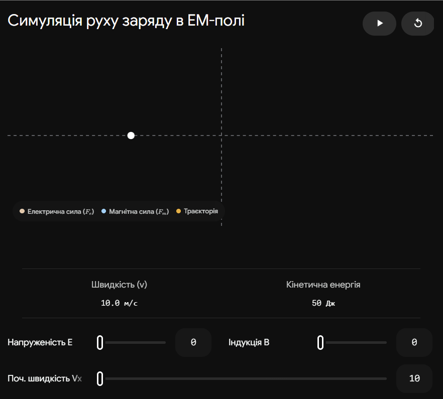

## 5. Функцiї Лагранжа i Гамiльтона для заряду в електромагнiтному полi.

### Ключова ідея

Рух електричного заряду в електромагнітному полі відрізняється від звичайної механіки тим, що сила Лоренца залежить не лише від координат, а й від швидкості частинки. Тому для опису такої системи вводять так званий «узагальнений (швидкісно-залежний) потенціал», який дозволяє коректно записати функції Лагранжа та Гамільтона, враховуючи взаємодію заряду як з електричним, так і з магнітним полями.

---

### Узагальнений потенціал

В електродинаміці електромагнітне поле задається двома потенціалами:

- $\varphi$ — скалярний потенціал (відповідає за електричне поле).
- $\vec{A}$ — векторний потенціал (відповідає за магнітне поле).

Звичайна потенціальна енергія $U = q\varphi$ не може описати магнітну силу, оскільки магнітне поле не виконує роботи, але змінює траєкторію. Тому вводиться ефективна потенціальна енергія $U_{eff}$, що залежить від швидкості $\vec{v}$:

$$U_{eff} = q\varphi - q\vec{v} \cdot \vec{A}$$

де $q$ — заряд частинки, $\vec{v}$ — вектор її швидкості.

### Функція Лагранжа ($L$)

Функція Лагранжа конструюється за стандартним правилом $L = T - U_{eff}$. Для нерелятивістської частинки масою $m$:

$$L = \frac{1}{2}mv^2 - q\varphi + q\vec{v} \cdot \vec{A}$$

- $\frac{1}{2}mv^2$ — кінетична енергія вільної частинки.
- $-q\varphi$ — енергія взаємодії зі скалярним полем.
- $q\vec{v} \cdot \vec{A}$ — доданок взаємодії з векторним полем (саме він генерує магнітну складову сили Лоренца при підстановці в рівняння Ейлера-Лагранжа).

### Узагальнений імпульс

Для переходу до функції Гамільтона необхідно знайти узагальнений імпульс $\vec{P}$, який є похідною Лагранжіана по швидкості:

$$\vec{P} = \frac{\partial L}{\partial \vec{v}} = m\vec{v} + q\vec{A}$$

**Увага на іспиті:** Узагальнений імпульс $\vec{P}$ в електромагнітному полі не дорівнює звичайному кінематичному імпульсу ($m\vec{v}$). Він містить додатковий польовий доданок $q\vec{A}$. Звідси виражаємо швидкість:

$$\vec{v} = \frac{\vec{P} - q\vec{A}}{m}$$

### Функція Гамільтона ($H$)

Функція Гамільтона визначається через перетворення Лежандра: $H = \vec{P} \cdot \vec{v} - L$. Підставляючи сюди вираз для $L$ та замінюючи швидкість $\vec{v}$ через узагальнений імпульс $\vec{P}$, отримуємо:

$$H = \frac{(\vec{P} - q\vec{A})^2}{2m} + q\varphi$$

Це фундаментальне рівняння показує, що магнітне поле (через $\vec{A}$) входить у кінетичну частину Гамільтоніана, тоді як електричне (через $\varphi$) — у потенціальну.

---

### Порівняльна таблиця

| Характеристика        | Функція Лагранжа ($L$)                                                                                     | Функція Гамільтона ($H$)                               |
| --------------------- | ---------------------------------------------------------------------------------------------------------- | ------------------------------------------------------ |
| **Робочі змінні**     | Координати $\vec{r}$ та швидкості $\vec{v}$                                                                | Координати $\vec{r}$ та узагальнені імпульси $\vec{P}$ |
| **Аналітичний вираз** | $L = \frac{m\vec{v}^2}{2} - q\varphi + q\vec{v} \cdot \vec{A}$                                             | $H = \frac{(\vec{P} - q\vec{A})^2}{2m} + q\varphi$     |
| **Фізичний зміст**    | Різниця між кінетичною та ефективною потенціальною енергіями                                               | Повна енергія системи (якщо поля стаціонарні)          |
| **Рівняння руху**     | Диференціальні рівняння 2-го порядку (дають силу Лоренца $\vec{F} = q\vec{E} + q[\vec{v} \times \vec{B}]$) | Канонічні рівняння 1-го порядку                        |

---

### Підсумок

Введення електромагнітного поля у формалізми класичної механіки вимагає використання узагальненого потенціалу, що залежить від швидкості. Це призводить до того, що функція Лагранжа отримує додатковий член $q\vec{v} \cdot \vec{A}$, а функція Гамільтона модифікується заміною звичайного імпульсу на так званий "подовжений імпульс" $\vec{P} - q\vec{A}$.

---

**Інтерактивна візуалізація: Дрейф заряду в схрещених полях**
Щоб зрозуміти, як складна взаємодія з $E$ та $B$ полями впливає на траєкторію (і чому механічний імпульс постійно змінюється напрямок, тоді як узагальнений містить польову компоненту).

