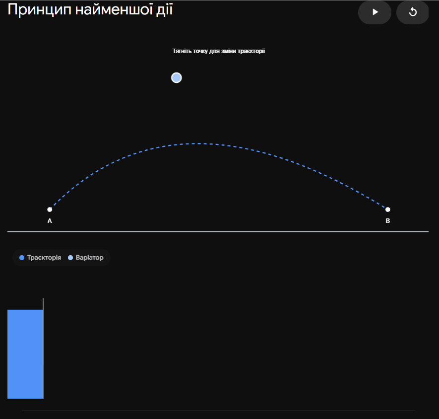

## 6. Принцип найменшої дiї Гамiльтона-Остроградського.

### Ключова ідея

Принцип найменшої дії (або принцип стаціонарної дії) — це найфундаментальніший постулат теоретичної фізики, який стверджує, що природа "обирає" найоптимальніший шлях. Замість покрокового обчислення сил та прискорень у кожній точці, цей принцип розглядає рух системи в цілому: з усіх можливих уявних траєкторій між двома станами системи в просторі та часі реально здійснюється лише та, для якої спеціальна величина — **Дія** — набуває екстремального (найчастіше мінімального) значення.

---

### Поняття Дії

Для математичного формулювання принципу вводиться скалярна величина, яка називається **Дією** (позначається $S$ або $W$). Вона є функціоналом, тобто числом, яке залежить від вигляду цілої функції (траєкторії).

Дія визначається як інтеграл за часом від функції Лагранжа $L(q, \dot{q}, t)$ між фіксованим початковим $t_1$ та кінцевим $t_2$ моментами часу:

$$S = \int_{t_1}^{t_2} L(q(t), \dot{q}(t), t) dt$$

де:

- $q(t)$ — узагальнені координати.
- $\dot{q}(t)$ — узагальнені швидкості.
- $L = T - U$ — функція Лагранжа (різниця кінетичної та потенціальної енергій).

### Математичне формулювання принципу

Принцип Гамільтона-Остроградського математично записується як умова стаціонарності (незмінності) дії при нескінченно малих варіаціях траєкторії. Варіація дії повинна дорівнювати нулю:

$$\delta S = \delta \int_{t_1}^{t_2} L(q, \dot{q}, t) dt = 0$$

**Важливі умови варіювання:**

1. Початкова і кінцева точки траєкторії є жорстко зафіксованими. Це означає, що варіації координат на кінцях шляху дорівнюють нулю: $\delta q(t_1) = 0$ та $\delta q(t_2) = 0$.
2. Час проходження вздовж усіх можливих (навіть нефізичних) траєкторій є однаковим. (Ізохронна варіація).

### Зв'язок з рівняннями руху

Якщо розписати варіацію $\delta S$, застосувати інтегрування частинами та врахувати нульові варіації на кінцях, ми отримаємо:

$$\int_{t_1}^{t_2} \sum_{i=1}^f \left( \frac{\partial L}{\partial q_i} - \frac{d}{dt} \frac{\partial L}{\partial \dot{q}_i} \right) \delta q_i dt = 0$$

Оскільки варіації $\delta q_i$ довільні, рівність нулю можлива лише тоді, коли вираз у дужках тотожно дорівнює нулю. Так ми отримуємо **рівняння Ейлера-Лагранжа**:

$$\frac{d}{dt}\left(\frac{\partial L}{\partial \dot{q}_i}\right) - \frac{\partial L}{\partial q_i} = 0$$

Отже, диференціальні рівняння руху системи є прямим математичним наслідком інтегрального принципу найменшої дії.

### Порівняння: Підхід Ньютона vs Підхід Гамільтона

| Характеристика          | Ньютонівська механіка                              | Принцип найменшої дії (Гамільтона)                                                |
| ----------------------- | -------------------------------------------------- | --------------------------------------------------------------------------------- |
| **Характер опису**      | Локальний (обчислює рух крок за кроком).           | Глобальний (оцінює всю траєкторію цілком).                                        |
| **Математичний апарат** | Векторний (сили $\vec{F}$, прискорення $\vec{a}$). | Скалярний (енергії $T, U$, функція Лагранжа $L$).                                 |
| **Вихідні рівняння**    | Диференціальні рівняння 2-го порядку.              | Варіаційне (інтегральне) рівняння $\delta S = 0$.                                 |
| **Універсальність**     | Обмежена звичайною макроскопічною механікою.       | Абсолютна. Застосовується в оптиці, електродинаміці, квантовій теорії та СТВ/ЗТВ. |

---

### Підсумок

Принцип найменшої дії Гамільтона-Остроградського — це вершина абстракції та елегантності в теоретичній фізиці. Він дозволяє звести всю динаміку системи, незалежно від її складності та вибору координат, до однієї скалярної функції Лагранжа та пошуку екстремуму відповідного їй інтеграла дії.

---

**Інтерактивна візуалізація: Пошук "ледачої" траєкторії (Принцип найменшої дії)**
Ця симуляція показує як природа "обирає" траєкторію. Син зможе власноруч змінювати форму шляху, по якому тіло летить кинуте під кутом до горизонту (в полі тяжіння), і спостерігати, як при цьому змінюється значення Дії $S$.

