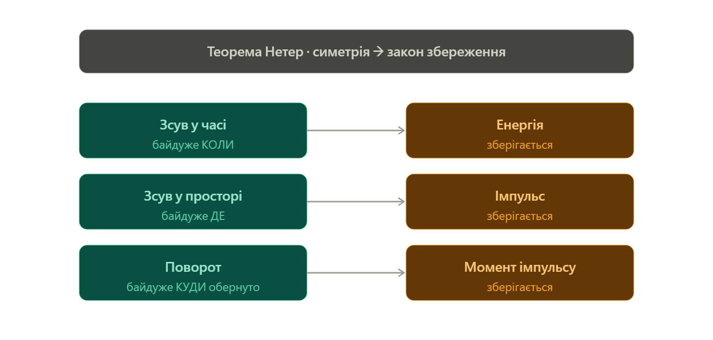
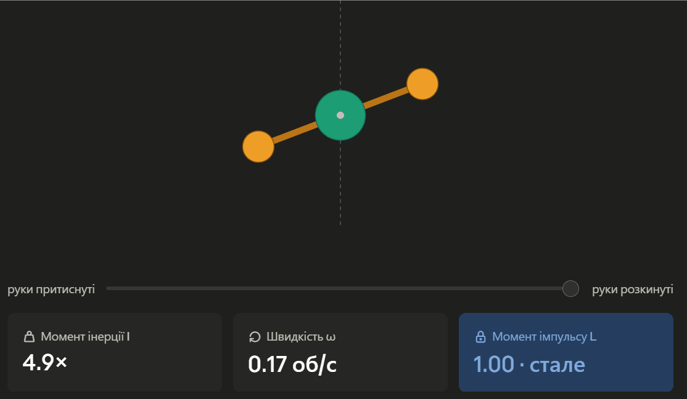

## 7. Симетрiя простору-часу i закони збереження.

### Ключова ідея

У класичній механіці фундаментальні властивості простору та часу (їхня однорідність та ізотропність) не просто філософські концепції. Завдяки теоремі Нетер, кожній такій геометричній симетрії математично і однозначно відповідає свій закон збереження певної фізичної величини. Це означає, що закони збереження імпульсу, енергії та моменту імпульсу — це прямий наслідок того, що наш простір-час є "однаковим" скрізь і в будь-якому напрямку.

---

### Теорема Нетер

Теорема Нетер стверджує: **Кожній неперервній симетрії фізичної системи відповідає закон збереження певної фізичної величини**.

Симетрія в цьому контексті означає, що функція Лагранжа (яка повністю визначає динаміку системи) не змінює свого вигляду (є інваріантною) при певних перетвореннях координат або часу.

### Основні симетрії та закони збереження

#### 1. Однорідність простору $\Rightarrow$ Збереження імпульсу

**Фізичний зміст:** Властивості замкненої системи не зміняться, якщо її паралельно перенести (зсунути) як ціле в іншу точку простору. У просторі немає "особливих" точок.

**Математичний вивід:**
Якщо система однорідна відносно зсуву на вектор $\delta\vec{r}$, то варіація Лагранжіана $\delta L = 0$.
Зсув означає $\vec{r}_i \to \vec{r}_i + \delta\vec{r}$ (усі радіус-вектори змінюються на однакову величину).

$$\delta L = \sum_i \frac{\partial L}{\partial \vec{r}_i} \delta\vec{r}_i = \left( \sum_i \frac{\partial L}{\partial \vec{r}_i} \right) \delta\vec{r} = 0$$

Оскільки зсув $\delta\vec{r}$ довільний, то сума в дужках дорівнює нулю. З рівнянь Ейлера-Лагранжа відомо, що $\frac{\partial L}{\partial \vec{r}_i} = \frac{d}{dt}\frac{\partial L}{\partial \dot{\vec{r}}_i} = \dot{\vec{p}}_i$.
Тому: $\frac{d}{dt} \sum_i \vec{p}_i = 0 \Rightarrow \vec{P} = \sum \vec{p}_i = const$.
_Повний імпульс системи зберігається._

#### 2. Ізотропність простору $\Rightarrow$ Збереження моменту імпульсу

**Фізичний зміст:** Властивості замкненої системи не зміняться, якщо її повернути як ціле на будь-який кут. У просторі немає виділених напрямків.

**Математичний вивід:**
При нескінченно малому повороті системи на кут $\delta\vec{\varphi}$ зміна радіус-вектора частинки дорівнює $\delta\vec{r}_i = [\delta\vec{\varphi} \times \vec{r}_i]$, а зміна швидкості $\delta\vec{v}_i = [\delta\vec{\varphi} \times \vec{v}_i]$. Інваріантність $L$ означає $\delta L = 0$.
Підставляючи варіації в $\delta L$ і використовуючи властивості мішаного добутку векторів, можна довести, що:

$$\frac{d}{dt} \sum_i [\vec{r}_i \times \vec{p}_i] = 0 \Rightarrow \vec{L} = \sum \vec{l}_i = const$$

_Повний момент імпульсу системи зберігається._

#### 3. Однорідність часу $\Rightarrow$ Збереження енергії

**Фізичний зміст:** Закони фізики не змінюються з плином часу. Дослід, проведений сьогодні, дасть ті самі результати, що й такий самий дослід завтра.

**Математичний вивід:**
Однорідність часу означає, що функція Лагранжа не залежить від часу _явно_: $\frac{\partial L}{\partial t} = 0$.
Повна похідна Лагранжіана по часу:

$$\frac{dL}{dt} = \sum_i \left( \frac{\partial L}{\partial q_i} \dot{q}_i + \frac{\partial L}{\partial \dot{q}_i} \ddot{q}_i \right) + \frac{\partial L}{\partial t}$$

Використовуючи рівняння Ейлера-Лагранжа $\frac{\partial L}{\partial q_i} = \frac{d}{dt}\frac{\partial L}{\partial \dot{q}_i}$ і враховуючи $\frac{\partial L}{\partial t} = 0$, після перетворень отримуємо:

$$\frac{d}{dt} \left( \sum_i \dot{q}_i \frac{\partial L}{\partial \dot{q}_i} - L \right) = 0$$

Вираз у дужках — це повна механічна енергія $E$ (яка збігається з Гамільтоніаном $H$).
_Повна механічна енергія системи зберігається._

### Зведена таблиця

| Властивість простору/часу | Геометричне перетворення      | Варіація параметра                                   | Величина, що зберігається (Закон)        |
| ------------------------- | ----------------------------- | ---------------------------------------------------- | ---------------------------------------- |
| **Однорідність простору** | Паралельне перенесення (зсув) | $\delta\vec{r} \neq 0$                               | Повний імпульс $\vec{P} = const$         |
| **Ізотропність простору** | Поворот осей                  | $\delta\vec{\varphi} \neq 0$                         | Повний момент імпульсу $\vec{L} = const$ |
| **Однорідність часу**     | Зсув у часі                   | $\delta t \neq 0, \frac{\partial L}{\partial t} = 0$ | Повна енергія $E = const$                |

---

### Підсумок

Закони збереження імпульсу, моменту імпульсу та енергії є прямим математичним наслідком того, що наш простір-час є однорідним та ізотропним. Це фундаментальний зв'язок між геометрією Всесвіту та динамікою фізичних систем.

---

Святе діло — рятувати студента від відрахування. Заходь, зараз буде боляче, але зрозуміло.

Уся ця тема тримається на одній геніальній ідеї, яку придумала математикиня **Еммі Нетер** (запам'ятай це ім'я, бо викладач любить про неї спитати). Теорема Нетер каже:

> **Кожного разу, коли природі на щось «байдуже», вона дарує тобі величину, яка зберігається.**

Ось і вся тема. Решта — деталі. Тепер розжовуємо.

## Що таке симетрія (по-людськи)

Симетрія — це не «гарненько і дзеркально». У фізиці симетрія — це коли **ти щось змінив, а воно не помітило різниці.**

Покрути ідеально круглий більярдний шар як хочеш — він виглядає так само. Йому _байдуже_ до повороту. Оце і є симетрія: байдужість до якоїсь зміни.

## Головна алегорія: Всесвіт — це чесне казино

Уяви, що закони фізики — це правила гри в казино. І це казино має три види чесності:

**1. Воно не міняє правила залежно від ЧАСУ.**
Прийдеш ти грати сьогодні, завтра чи через мільярд років — коефіцієнти ті самі. Казино не накручує ставки опівночі. Природі **байдуже КОЛИ** ти ставиш експеримент.
→ За цю чесність вона платить тобі **збереженням енергії**.

**2. Воно не міняє правила залежно від МІСЦЯ.**
Граєш ти в Білій Церкві, на Марсі чи в галактиці Андромеди — фізика однакова. Природі **байдуже ДЕ**.
→ За це — **збереження імпульсу**.

**3. Воно не міняє правила залежно від того, куди ти ПОВЕРНУТИЙ.**
Стоїш обличчям на північ чи на схід — закони ті самі. Природі **байдуже В ЯКОМУ НАПРЯМКУ**.
→ За це — **збереження моменту імпульсу** (кутового моменту).

Бачиш фокус? **Три види «байдужості» (симетрії) → три закони збереження.** Це не збіг. Нетер математично довела, що це залізний зв'язок: немає симетрії без збереження, немає збереження без симетрії.

## Як це запам'ятати на іспиті

Якщо забудеш формули — згадай словесний ланцюжок «байдужість → подарунок»:

- байдуже **КОЛИ** (зсув у часі) → **енергія**
- байдуже **ДЕ** (зсув у просторі) → **імпульс**
- байдуже **КУДИ ОБЕРНУТО** (поворот) → **момент імпульсу**

Мнемоніка: **«Коли-Де-Куди»** → **«Енергія-Імпульс-Момент»**. Три питання — три відповіді.

Тримай шпаргалку — лівий стовпчик це симетрія (байдужість), правий це те, що за неї зберігається.Тепер найсмачніше — **чому саме зсув у часі дає енергію, а не щось інше.** Тут є аргумент, від якого викладачі тануть, бо він показує, що ти _розумієш_, а не зазубрив.

## Доказ «від протилежного»: уявімо, що енергія НЕ зберігається

Припустимо на хвилинку, що закони фізики таки залежать від часу. Скажімо, гравітація **в понеділок слабша**, ніж у вівторок. Що тоді?

Дивись, який гешефт можна провернути:

1. У **понеділок** (гравітація слабка) ти піднімаєш важкий камінь на гору. Це **дешево** — тягнути проти слабкої гравітації легко, витратив мало енергії.
2. Чекаєш до **вівторка** (гравітація сильна). Опускаєш камінь вниз і збираєш енергію падіння — наприклад, крутиш ним динамо-машину. А це вже **дорого коштує** в твою користь — сильна гравітація віддає багато енергії.
3. Profit. Ти отримав енергії більше, ніж витратив. Поклав у кишеню різницю **з нічого**.

Це **вічний двигун**. Повторюй цей цикл понеділок–вівторок нескінченно і качай безкоштовну енергію зі Всесвіту.

## У чому суть

Природа такого не дозволяє. А не дозволяє саме тому, що **закони фізики однакові в понеділок і вівторок** — гравітація не «перемикається». Ось ця незмінність законів у часі (симетрія зсуву в часі) і є тим, що **забороняє безкоштовний обід** і змушує енергію точно зберігатися.

Тобто зв'язок двосторонній і залізний:

> **Закони не залежать від часу ⟺ енергію не можна створити з нічого ⟺ енергія зберігається.**

Енергія — це буквально та «валюта», яку рахує бухгалтер Всесвіту, щоб переконатися, що ніхто не змахлював з часом. Саме _час_, а не простір, бо махлювати ми збиралися, переносячи дію **в різні моменти**. Перенесли б у різні **точки простору** — спіймали б за руку закон збереження імпульсу (там та сама логіка, тільки камінь їде вбік, а не в майбутнє).

Якщо на захисті скажеш оцю фразу про вічний двигун — усе, ти врятований.

Розберемо так само наочно зв'язок «простір → імпульс», щоб і його клацати від зубів...

Будуємо рівно за тим самим лекалом, щоб у голові вони стояли парою.

## Доказ «від протилежного»: уявімо, що імпульс НЕ зберігається

Минулого разу ми ламали час. Тепер ламаємо **простір**. Припустимо, що закони фізики залежать від того, **де** ти знаходишся. Скажімо, є десь у порожньому космосі чарівна точка — «улюблене місце» Всесвіту, де просто _перебувати_ енергетично вигідніше. І ніщо її не створює: ні планета, ні зоряна маса, ні заряд. Просто адреса така щаслива.

Що тоді?

1. Будь-який предмет, опинившись поряд, **відчує тягу** до цієї точки — бо туди «під гірку». Він почне сам собою розганятися в той бік.
2. Розігнався → набрав швидкість → набрав **імпульс**. З нічого. Ніхто його не штовхав, пального не палив.
3. Profit. Знову безкоштовний обід: вільний імпульс, а з ним і вільна кінетична енергія. Той самий вічний двигун, тільки збоку.

## У чому суть

Природа й цього не дозволяє. А не дозволяє саме тому, що **в порожньому просторі немає привілейованих адрес** — будь-яка точка нічим не краща за сусідню (це називають однорідністю простору). Немає «улюбленого місця» → немає вбудованої «гірки» → немає сили, яка б тебе кудись зіштовхнула просто за факт розташування. А якщо нема сили — **імпульс нікуди не дівається**, він просто залишається тим, яким був.

Ось ключова інтуїція, запиши її золотими літерами:

> **Сила — це «нахил» простору.** Там, де простір однаковий усюди, нахилу нема, штовхати нема чому → імпульс зберігається.

## Як це виглядає в житті

Збереження імпульсу ти бачив тисячу разів, просто не знав, що це воно:

- **Фігуристка на ідеальному льоду** не може почати рух «з себе». Щоб поїхати вперед, вона мусить щось кинути назад. Чому? Бо лід однаковий скрізь — немає чарівної точки, до якої можна «впасти» задарма.
- **Ракета** летить уперед лише тому, що **викидає газ назад**. Не від поверхні відштовхується — у вакуумі немає поверхні. Вона позичає імпульс у власного палива.

І ось чому бухгалтерія завжди сходиться: змінити свій імпульс можна **тільки забравши його в когось іншого** (відштовхнувся → той отримав рівно стільки ж у протилежний бік, оце і є віддача). Сумарний імпульс системи — константа. Книги Всесвіту знову в нулі.

## Уся пара поруч

Тепер відчуй симетрію самих _аргументів_ — вони ідентичні, міняється лише одне слово:

- махлюєш **у часі** (різні моменти) → ловить **збереження енергії**;
- махлюєш **у просторі** (різні точки) → ловить **збереження імпульсу**.

Один і той самий трюк, дві різні «камери спостереження». Якщо на захисті розкажеш обидва приклади — вічний двигун у часі й чарівну точку в просторі — комісія зрозуміє, що ти не зубрив, а _бачиш_ механізм. А це вже зовсім інша розмова.

Лишився третій близнюк — **поворот → момент імпульсу** (там зірка фігуристки, що крутиться і притискає руки).

О, фігуристка — це найкрасивіший приклад з усієї трійці. Дай-но я зроблю його живим, щоб ти сам покрутив.Тримай — крути слайдер: розкинуті руки = повільно, притиснуті = вжух. Дивись, що при цьому робить L.Тепер розберемо, що ти щойно крутив.

## Чому руки всередину = швидше

Момент імпульсу — це добуток двох речей:

> **L = I × ω** (момент інерції × швидкість обертання)

`I` (момент інерції) — це наскільки «розмазана» твоя маса від осі. Руки розкинуті → маса далеко → `I` велике. Притиснув руки → маса під'їхала до осі → `I` маленьке (бо в формулу входить **квадрат** відстані, тому ефект потужний).

А тепер головне: фігуристка, поки крутиться, **нічим себе не штовхає** — нема зовнішнього моменту сили (лід гладкий). Отже, `L` мусить лишатися сталим. Але якщо вона зменшила `I`, притиснувши руки, то рівняння `L = I × ω` має якось вціліти. Єдиний вихід — **ω підскакує вгору**. Маса нікуди не зникла, вона просто переїхала ближче до центру, і за це їй «доплатили» швидкістю. Звідси і той ефектний вжух на льоду.

Це і є збереження моменту імпульсу в чистому вигляді: `I` та `ω` торгуються між собою, а їхній добуток `L` — недоторканна константа (та сама синя плашка у віджеті, що не ворухнулась).

## А де тут симетрія?

За тим самим лекалом, що й попередні двоє. Ламаємо тепер **напрямок**.

Уяви, що в порожньому космосі є **привілейований напрямок** — наче в простору вбудований компас, і дивитися «туди» енергетично вигідніше, ніж убік. І знов: ніщо його не створює, просто така забаганка Всесвіту.

Що тоді? Будь-який предмет почав би сам **доверта́тися**, щоб «вишикуватись» у вигідний бік — набираючи обертання з нічого. Знову вічний двигун, тільки крутильний.

Природа й цього не дозволяє, бо **в просторі немає виділеного напрямку** — усі сторони рівноцінні (це називають ізотропністю простору). Нема улюбленого боку → нема моменту сили, що довертав би тебе задарма → **момент імпульсу зберігається**.

## Уся трійця, тепер повна

Відчуй, що це буквально одна думка в трьох костюмах:

- махлюєш **у часі** (різні моменти) → ловить **енергія**;
- махлюєш **у місці** (різні точки) → ловить **імпульс**;
- махлюєш **у напрямку** (різні орієнтації) → ловить **момент імпульсу**.

Три види «байдужості» простору-часу — три недоторканні величини. Оце і вся теорема Нетер, яку ти тепер можеш не просто назвати, а _пояснити на пальцях_. Якщо комісія попросить приклад — фігуристка, що притискає руки, закриває питання миттєво.

---

_Конспект на одну сторінку_

# Симетрія простору-часу і закони збереження

**Шпаргалка на захист.** Головна думка одна, прикладів три. Якщо запам'ятаєш ланцюжок «байдужість → подарунок» — вистачить.

---

## Головна теза (теорема Нетер)

> **Кожній неперервній симетрії природи відповідає своя величина, що зберігається.**

«Симетрія» = природі **байдуже** до якоїсь зміни (зробив зміну — закони не помітили різниці). За кожну таку байдужість Всесвіт «доплачує» збереженою величиною. Довела це математикиня **Еммі Нетер** (1918).

---

## Уся карта на одному рядку

| Симетрія (байдужість до…)            | Що зберігається     |
| ------------------------------------ | ------------------- |
| зсуву в **часі** — байдуже КОЛИ      | **енергія**         |
| зсуву в **просторі** — байдуже ДЕ    | **імпульс**         |
| **повороту** — байдуже КУДИ обернуто | **момент імпульсу** |

Мнемоніка: **«Коли — Де — Куди» → «Енергія — Імпульс — Момент»**.

---

## Три приклади (метод «уявімо, що НЕ зберігається»)

Усі три — той самий трюк: припускаємо порушення, отримуємо вічний двигун, природа забороняє.

**1. Час → енергія.**
Якби гравітація в понеділок була слабша, ніж у вівторок: піднімаєш камінь у понеділок (дешево), опускаєш у вівторок (отримуєш більше) → безкоштовна енергія з нічого. Заборонено, бо **закони фізики однакові в усі моменти часу**. Звідси — збереження енергії.

**2. Простір → імпульс.**
Якби в порожньому космосі була «улюблена точка», до якої вигідно падати: предмет розганявся б туди сам собою, набираючи імпульс з нічого. Заборонено, бо **всі точки простору рівноцінні** (однорідність). Сила — це «нахил» простору; нема нахилу → нема сили → імпульс не змінюється.
_Життєвий доказ:_ ракета летить уперед лише тому, що викидає газ назад; фігуристка на льоду не зрушить, не кинувши щось у протилежний бік.

**3. Поворот → момент імпульсу.**
Якби в просторі був «привілейований напрямок», предмет довертався б до нього сам, набираючи обертання з нічого. Заборонено, бо **всі напрямки рівноцінні** (ізотропність). Звідси — збереження моменту імпульсу.
_Зірковий доказ:_ **фігуристка**. Притискає руки → момент інерції `I` падає (маса під'їхала до осі) → щоб `L = I·ω` лишилось сталим, **швидкість `ω` підскакує**. Той самий ефектний вжух.

---

## Формули, які варто знати

- Момент імпульсу: **L = I · ω** (зберігається, коли нема зовнішнього моменту сили)
- Імпульс: **p = m · v** (зберігається, коли нема зовнішньої сили)
- Зв'язок «сила = нахил потенціалу»: **F = −dU/dx** (однорідність простору → нема залежності U від положення → F = 0)

---

## Фрази для захисту (вивчити дослівно)

- «Кожна неперервна симетрія дії породжує закон збереження — це теорема Нетер.»
- «Однорідність часу дає збереження енергії: якби закони залежали від моменту часу, можна було б побудувати вічний двигун.»
- «Однорідність простору дає збереження імпульсу, ізотропність простору — збереження моменту імпульсу.»
- «Класичний приклад збереження моменту імпульсу — фігуристка: притискаючи руки, вона зменшує момент інерції, тож кутова швидкість зростає, бо добуток `I·ω` сталий.»

---

_Якщо забув усе інше — згадай фігуристку і вічний двигун. З цих двох образів решта розкручується сама._
