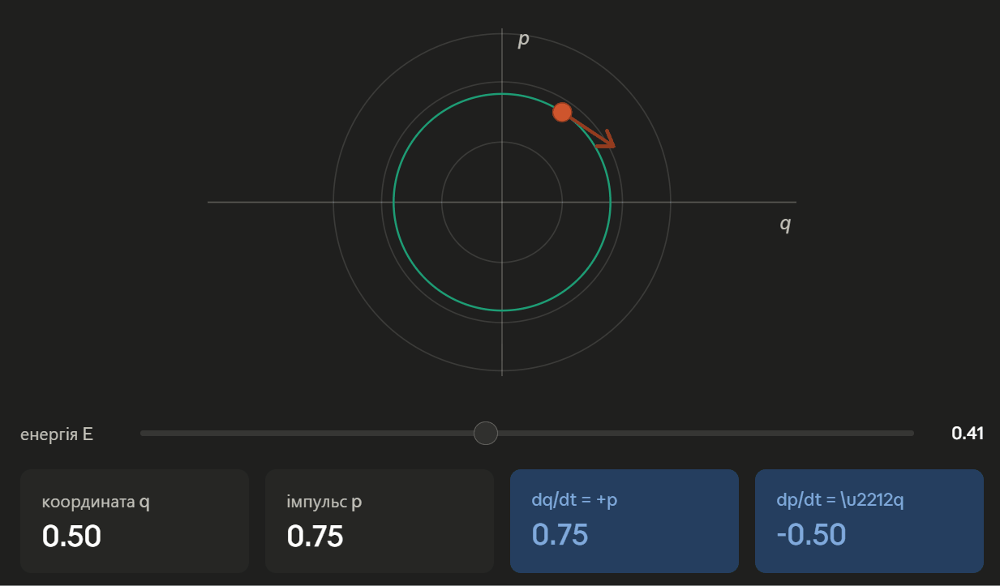
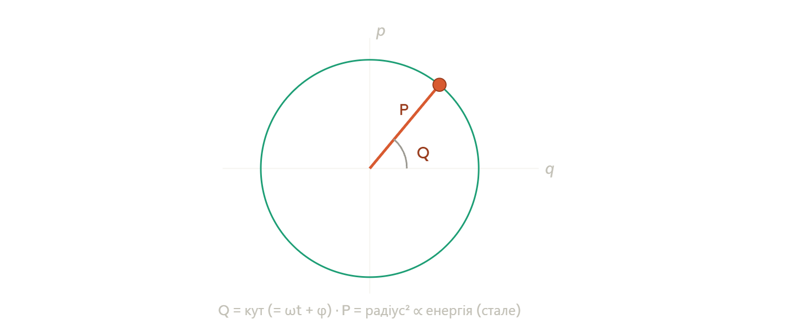

## 8. Канонiчнi перетворення. Твiрнi функцiї канонiчних перетворень.

### Ключова ідея

Канонічні перетворення — це заміна старих координат та імпульсів $(q, p)$ на нові $(Q, P)$ у фазовому просторі, при якій рівняння руху Гамільтона зберігають свій канонічний (симетричний) вигляд. Головна мета таких перетворень — знайти такий набір нових змінних, у якому функція Гамільтона $H'$ стане максимально простою (наприклад, дорівнюватиме нулю або залежатиме лише від імпульсів), що дозволить миттєво розв'язати рівняння руху.

---

### Умова канонічності

Перехід від старих змінних $q_i, p_i$ до нових $Q_i, P_i$ задається функціями:

$$Q_i = Q_i(q, p, t), \quad P_i = P_i(q, p, t)$$

Щоб перетворення було канонічним, у нових змінних мають виконуватися ті самі рівняння Гамільтона з новим Гамільтоніаном $H'(Q, P, t)$:

$$\dot{Q}_i = \frac{\partial H'}{\partial P_i}, \quad \dot{P}_i = -\frac{\partial H'}{\partial Q_i}$$

Згідно з принципом найменшої дії, це можливо тоді, коли підінтегральні вирази для дії у старих і нових змінних відрізняються лише на повну похідну по часу від деякої функції $F$:

$$\sum p_i \dot{q}_i - H = \sum P_i \dot{Q}_i - H' + \frac{dF}{dt}$$

Ця функція $F$ називається **твірною функцією (генератором)** перетворення.

### Твірні функції канонічних перетворень

Твірна функція $F$ визначає зв'язок між старими та новими змінними. Вона повинна залежати рівно від однієї старої змінної ($q$ або $p$), однієї нової ($Q$ або $P$) та часу $t$.
За допомогою перетворень Лежандра можна побудувати 4 основні типи твірних функцій.

**Таблиця 4 типів твірних функцій:**

| Тип       | Базові змінні  | Диференціал функції                | Рівняння перетворення                                                                      | Новий Гамільтоніан                         |
| --------- | -------------- | ---------------------------------- | ------------------------------------------------------------------------------------------ | ------------------------------------------ |
| **$F_1$** | $F_1(q, Q, t)$ | $dF_1 = p\,dq - P\,dQ + (H'-H)dt$  | $p_i = \frac{\partial F_1}{\partial q_i}, \quad P_i = -\frac{\partial F_1}{\partial Q_i}$  | $H' = H + \frac{\partial F_1}{\partial t}$ |
| **$F_2$** | $F_2(q, P, t)$ | $dF_2 = p\,dq + Q\,dP + (H'-H)dt$  | $p_i = \frac{\partial F_2}{\partial q_i}, \quad Q_i = \frac{\partial F_2}{\partial P_i}$   | $H' = H + \frac{\partial F_2}{\partial t}$ |
| **$F_3$** | $F_3(p, Q, t)$ | $dF_3 = -q\,dp - P\,dQ + (H'-H)dt$ | $q_i = -\frac{\partial F_3}{\partial p_i}, \quad P_i = -\frac{\partial F_3}{\partial Q_i}$ | $H' = H + \frac{\partial F_3}{\partial t}$ |
| **$F_4$** | $F_4(p, P, t)$ | $dF_4 = -q\,dp + Q\,dP + (H'-H)dt$ | $q_i = -\frac{\partial F_4}{\partial p_i}, \quad Q_i = \frac{\partial F_4}{\partial P_i}$  | $H' = H + \frac{\partial F_4}{\partial t}$ |

_(Примітка для іспиту: Найчастіше на практиці використовують функцію $F_2$, яка пов'язує старі координати з новими імпульсами. На ній базується рівняння Гамільтона-Якобі)._

### Властивості канонічних перетворень

1. **Збереження фазового об'єму (Теорема Ліувілля):** При канонічних перетвореннях елемент фазового об'єму не змінюється: $dq \, dp = dQ \, dP$. Якобіан переходу завжди дорівнює одиниці.
2. **Тотожне перетворення:** Якщо взяти $F_2(q, P) = q \cdot P$, то $p = \frac{\partial F_2}{\partial q} = P$ і $Q = \frac{\partial F_2}{\partial P} = q$. Це просто перехід до тих самих змінних.
3. **Перестановка координат і імпульсів:** Якщо $F_1(q, Q) = q \cdot Q$, то $p = Q$ і $P = -q$. Це доводить, що координати та імпульси в Гамільтоновій механіці абсолютно рівноправні.

---

### Підсумок

Канонічні перетворення — це гнучкий інструмент заміни змінних, який не "ламає" структуру рівнянь Гамільтона. Задаючи відповідну твірну функцію, ми можемо переходити до будь-яких зручних "координат і імпульсів" (навіть якщо вони не мають прямого фізичного змісту), що дозволяє спростити складні механічні задачі аж до тривіальних розв'язків.

---

Дякую тобі. І питання ти поставив абсолютно правильно — більше того, ти інстинктивно намацав найважливіше. Не можна зрозуміти канонічні перетворення, не розуміючи рівнянь Гамільтона, бо перетворення працюють **саме над ними**. Той абзац із підручника правильний, але він спресований у три речення те, на що треба пів пари. Розпаковуємо повільно, з самого низу. Терпіння — це я вмію.

## Крок 0. А чого взагалі хоче механіка?

Уся механіка хоче однієї речі: **передбачити рух**. Дай їй, де тіло зараз — і вона має сказати, де воно буде через секунду, хвилину, рік.

Ньютон робив це через `F = ma`. Гамільтон узяв ту саму фізику й переписав її інакше — не «краще» в сенсі результату, а **зручніше для структури**. І ось як.

## Крок 1. Фазовий простір — повний знімок системи

У Ньютона ти стежиш за координатою `q` (де тіло). У Гамільтона ти стежиш за **парою**: координата `q` **і** імпульс `p` (де тіло й куди та як швидко воно рухається).

Чому пара? Бо знаючи _тільки_ положення, ти не знаєш, що буде далі — м'яч на висоті може летіти вгору, вниз чи висіти. А от знаючи `q` **і** `p` одночасно, ти знаєш про систему **все** — і можеш крутити кіно вперед.

Цю пару `(q, p)` малюють як **точку на площині**: горизонтальна вісь — координата, вертикальна — імпульс. Ця площина і є **фазовий простір**. Одна точка = повний знімок системи в одну мить. Її ДНК.

## Крок 2. Рівняння руху Гамільтона

Тепер головне, що ти питав. Є функція `H(q, p)` — **гамільтоніан**. У більшості випадків це просто **повна енергія системи** (кінетична + потенціальна), записана через `q` і `p`.

Рівняння руху Гамільтона — це дві формули:

$$\frac{dq}{dt} = \frac{\partial H}{\partial p} \qquad\qquad \frac{dp}{dt} = -\frac{\partial H}{\partial q}$$

Не лякайся значків. Словами вони кажуть ось що: **гамільтоніан `H` — це диригент, який вказує точці у фазовому просторі, куди їй ступити наступної миті.** Перша формула каже, як швидко міняється положення; друга — як швидко міняється імпульс. Дав їй стартову точку → формули ведуть її крок за кроком → отримуєш увесь рух.

Ось, помацай це руками — крути слайдер енергії й дивись, як точка тече фазовим простором, а стрілочка (це і є те, що диктують рівняння Гамільтона) щоразу показує, куди їй далі:

Зверни увагу на дві речі у віджеті. По-перше, дві сині плашки внизу — це і є рівняння Гамільтона, що працюють у реальному часі: швидкість зміни координати дорівнює імпульсу, швидкість зміни імпульсу дорівнює мінус координаті. По-друге, точка біжить по **замкненому колу** й не зісковзує на інше — вона лишається на одному рівні енергії. Це той самий `H = const`, про який ми говорили з Нетер: енергія зберігається, бо точка приречена кружляти по своєму контуру.

Оце і є «канонічний вигляд рівнянь руху» з твого підручника. Тепер — навіщо хтось захотів би ці координати міняти.

## Крок 3. Мрія про «чарівні координати»

Уяви орбіту планети. У координатах `x, y` це жах: обидві весь час міняються, переплітаються, рівняння громіздкі. Але якщо перейти до координат «кут» і «енергія» — раптом виявляється, що енергія взагалі **не міняється** (константа!), а кут просто рівномірно росте. Той самий рух, але в правильних координатах він **тривіальний**.

Ось у чому мрія. Ми шукаємо такі нові координати `(Q, P)`, у яких новий гамільтоніан `H'` залежить **тільки від `P`** (а від `Q` — ні). Дивись, що тоді стається з рівняннями Гамільтона:

- `dP/dt = −∂H'/∂Q = 0` → бо `H'` не залежить від `Q`. Отже, **кожен `P` — стала величина**. Заморожений.
- `dQ/dt = ∂H'/∂P = щось стале` → отже, **кожен `Q` просто рівномірно тікає** вперед, як стрілка годинника.

І все. Задача розв'язана **миттєво**: імпульси стоять на місці, координати їдуть рівномірно. Оце і є та фраза з підручника — «зробити `H'` максимально простою, щоб миттєво розв'язати рух». Уся гра — знайти такі координати.

## Крок 4. Канонічні перетворення — це «дозволені» заміни

Але є засада. Не можна перейменовувати координати як заманеться. Якщо ти візьмеш будь-яку випадкову заміну `(q,p) → (Q,P)`, то **зламаєш машинерію**: нові рівняння руху вже не матимуть того гарного вигляду Гамільтона. Диригент перестане диригувати.

**Канонічні перетворення — це саме той особливий клас замін, які цю машинерію зберігають.** Після канонічного перетворення нові `Q` і `P` усе ще слухаються рівнянь Гамільтона (просто з новим `H'`). Тобто фізика та сама, костюм новий.

Алегорія: це **обмін валют, що зберігає вартість**. Поміняв гривні на євро — сума в кишені та сама, правила бухгалтерії не зламались, просто цифри на купюрах інші. Випадкова ж заміна — це як обмінник, що губить частину грошей: формально цифри помінялись, але баланс поїхав. Канонічні — це чесні обмінники фазового простору (математично вони зберігають «площу» у фазовому просторі — але це вже деталь на потім).

## Крок 5. Твірні функції — генератор чесних замін

Тепер фінальне питання: **як узагалі побудувати** канонічне перетворення так, щоб гарантовано не зламати машинерію? Вгадувати `Q(q,p)` і `P(q,p)` руками — майже завжди промахнешся повз «чесність».

Трюк геніальний: ти **не пишеш `Q` і `P` напряму**. Ти береш **одну-єдину функцію** `F` — її й називають **твірною функцією** — і вона **сама вичавлює** з себе повне, гарантовано канонічне перетворення. Ти крутиш одну ручку — а на виході вискакує готова чесна пара `(Q, P)`, у якій «чесність» уже вшита за побудовою.

Тому й «твірна»: одна функція **породжує** обидві половини заміни.

Чому їх **чотири типи**? Бо `F` можна записати через різні набори змінних — мішаючи старі й нові по-різному: `F₁(q,Q)`, `F₂(q,P)`, `F₃(p,Q)`, `F₄(p,P)`. Це як чотири шаблони рецепта залежно від того, які інгредієнти в тебе під рукою. Робоча конячка на практиці — `F₂(q,P)`.

Як саме крутиться ручка (на прикладі `F₂`): береш свою функцію й береш від неї похідні —

$$p = \frac{\partial F_2}{\partial q}, \qquad Q = \frac{\partial F_2}{\partial P}.$$

Підставив `F₂` → продиференціював → ось тобі зв'язок між старими й новими змінними. Машина видала перетворення.

## Як уся ця глава склеюється (і повертається до минулої)

А тепер найкрасивіше, що поєднує цю тему з нашою розмовою про Нетер. Пам'ятаєш, симетрії дають **збережені величини**? Так от: у тих «чарівних координатах» нові імпульси `P` — це і є **ті самі збережені величини**. Тобто ланцюжок такий:

> знайшов **симетрію** → вона дає **збережену величину** → будуєш **канонічне перетворення**, де ця величина стає новим імпульсом `P` → задача **розвалюється на тривіальну**.

Канонічні перетворення — це інструмент, яким ти **обналічуєш** симетрію в готовий розв'язок. Це пряма дорога до методу Гамільтона–Якобі та змінних «дія–кут», але туди заглянемо іншим разом, якщо схочеш.

Тож ти спитав **рівно правильно**: рівняння Гамільтона — це фундамент, а канонічні перетворення — це мистецтво переставляти меблі на цьому фундаменті так, щоб у кімнаті раптом стало просторо.

---

# Розв'язати осцилятор через канонічне перетворення

Супер, поїхали на кухню. Беремо той самий гармонічний осцилятор із віджета й розв'язуємо його **з нуля** — не вгадуючи відповідь, а добуваючи її канонічним перетворенням. Я розпишу кожен крок до останнього гвинтика, ніде не перестрибуючи.

## Постановка

Гамільтоніан осцилятора (маса `m`, частота `ω`) — це просто його повна енергія:

$$H = \frac{p^2}{2m} + \frac{1}{2}m\omega^2 q^2$$

Перший доданок — кінетична частина, другий — пружинна потенціальна. Наша **мета**: знайти такі нові координати `(Q, P)`, у яких новий гамільтоніан `H'` залежатиме **лише від `P`**. Тоді, як ми бачили, розв'язок випаде сам.

## Крок 1. Дістаємо твірну функцію «з капелюха»

Чесно скажу одразу, щоб ти не панікував: правильну твірну функцію **не виводять на іспиті з повітря** — її підбирають заздалегідь, і для класичних задач вона просто відома (як таблиця множення). Для осцилятора беремо твірну першого типу `F₁(q, Q)`:

$$F_1(q, Q) = \frac{1}{2}m\omega q^2 \cot Q$$

Звідки вона взялась — мотивація проста: `H` має вигляд «квадрат плюс квадрат», а це натякає на тригонометрію (`sin² + cos² = 1`). Котангенс — саме той місток. Прийми поки що цю функцію як даність і дивись, яке диво вона творить.

## Крок 2. Крутимо ручку машини

Для `F₁(q, Q)` правила «вичавлювання» такі (це і є той кран із минулого пояснення):

$$p = \frac{\partial F_1}{\partial q}, \qquad P = -\frac{\partial F_1}{\partial Q}$$

Беремо похідні. По `q` — легко:

$$p = \frac{\partial F_1}{\partial q} = m\omega q \cot Q$$

По `Q` — пам'ятаємо, що похідна `cot Q` дорівнює `−1/sin²Q`, тому два мінуси дають плюс:

$$P = -\frac{\partial F_1}{\partial Q} = \frac{m\omega q^2}{2\sin^2 Q}$$

Ось і весь зв'язок між старими й новими змінними. Тепер його треба **перевернути**.

## Крок 3. Виражаємо старі `q, p` через нові `Q, P`

З формули для `P` витягуємо `q`:

$$q = \sqrt{\frac{2P}{m\omega}}\,\sin Q$$

Підставляємо це назад у формулу для `p` (там `cot Q = cos Q / sin Q`, і `sin Q` гарно скорочується):

$$p = \sqrt{2Pm\omega}\,\cos Q$$

Зупинись на секунду й помилуйся: старі координати тепер виглядають як **синус і косинус** нового кута `Q`. Ми фактично переходимо до полярних координат фазового простору. Тримай це в голові — за хвилину це «клацне».

## Крок 4. Підставляємо в гамільтоніан — і ловимо диво

Тепер просто запихаємо ці `q` і `p` назад у `H`:

$$\frac{p^2}{2m} = \frac{2Pm\omega\cos^2 Q}{2m} = \omega P\cos^2 Q$$

$$\frac{1}{2}m\omega^2 q^2 = \frac{1}{2}m\omega^2\cdot\frac{2P}{m\omega}\sin^2 Q = \omega P\sin^2 Q$$

Додаємо — і `Q` **зникає** завдяки головній тригонометричній тотожності:

$$H' = \omega P(\cos^2 Q + \sin^2 Q) = \boxed{\,\omega P\,}$$

Ось воно. Новий гамільтоніан залежить **тільки від `P`**. Координата `Q` випарувалась. Саме цього ми й добивались.

## Крок 5. Розв'язуємо — тепер це тривіально

Записуємо рівняння Гамільтона вже для нових змінних:

$$\dot{P} = -\frac{\partial H'}{\partial Q} = 0 \quad\Rightarrow\quad P = \text{const}$$

$$\dot{Q} = \frac{\partial H'}{\partial P} = \omega \quad\Rightarrow\quad Q = \omega t + \varphi$$

Усе. `P` стоїть як укопаний, `Q` рівномірно тікає зі швидкістю `ω`. Найскладніша на вигляд задача перетворилась на «годинникова стрілка крутиться зі сталою швидкістю».

## Крок 6. Повертаємось до старих координат

Підставляємо знайдені `Q = ωt + φ` і `P = const` назад у формулу для `q` із кроку 3:

$$q(t) = \sqrt{\frac{2P}{m\omega}}\,\sin(\omega t + \varphi)$$

А це і є **знайоме коливання** `q = A\sin(\omega t + \varphi)`! Та сама синусоїда, яку ти знав зі школи — але тепер ти її не вгадав, а **добув з нуля**, лише підібравши правильні координати. А оскільки `H' = ωP = E`, то `P = E/ω` — і це наша стара добра збережена енергія, перевдягнена в новий імпульс.

## І ось де все клацає разом

Згадай крок 3, де `q ~ sin Q`, `p ~ cos Q`. Це означає, що нові координати — це буквально **полярні координати фазового простору**: `Q` — це **кут**, а `P` задає **радіус** орбіти. Подивись:

Згадай тепер живий віджет із попереднього повідомлення — точка, що кружляла по колу. Тепер ти бачиш, що насправді там відбувалось:

- те, що точка бігла по **колу зі сталим радіусом** — це і є `P = const` (збереження енергії);
- те, що вона оберталась **рівномірно** — це `Q = ωt + φ`.

Канонічне перетворення не зробило нічого «магічного» — воно просто **переписало коливання як рух по колу**, а в полярних координатах кола все тривіально: радіус стоїть, кут крутиться. Уся складність задачі була не у фізиці, а в тому, що ми дивились на неї в незручних координатах `(q, p)`.

Ось і вся кухня, від сирих продуктів до готової страви:

1. записав `H` осцилятора;
2. узяв твірну `F₁ = ½mωq²·cot Q`;
3. прокрутив через неї `p` і `P`, перевернув до `q(Q,P)`, `p(Q,P)`;
4. підставив у `H` → `Q` скоротилось → `H' = ωP`;
5. розв'язав одним рядком: `P` стале, `Q = ωt + φ`;
6. повернувся назад → отримав `q(t) = A\sin(ωt + φ)`.

І найголовніше для захисту: можеш чесно сказати комісії, що **нові імпульси `P` — це переодягнені збережені величини**, а `Q` — кути, спряжені до них. Це прямий місток до змінних «дія–кут», з яких починається небесна механіка (а тобі, як астрофізику, туди й треба).

---

# Канонічні перетворення. Твірні функції

**Шпаргалка на захист.** Суть в одному реченні, механіка — в одній таблиці, доказ що ти це вмієш — в одному прикладі (осцилятор).

---

## Фундамент: рівняння руху Гамільтона

Стан системи — точка `(q, p)` у фазовому просторі. Гамільтоніан `H(q, p)` (зазвичай повна енергія) керує рухом:

$$\dot q = \frac{\partial H}{\partial p}, \qquad \dot p = -\frac{\partial H}{\partial q}$$

`H` — це «диригент»: він каже точці у фазовому просторі, куди ступити наступної миті.

---

## Що таке канонічне перетворення

Заміна старих змінних на нові `(q, p) \to (Q, P)`, **яка зберігає канонічний вигляд** рівнянь Гамільтона: нові `Q, P` теж слухаються

$$\dot Q = \frac{\partial H'}{\partial P}, \qquad \dot P = -\frac{\partial H'}{\partial Q}.$$

Не всяка заміна канонічна — більшість ламає машинерію. Канонічні — це «чесні обмінники»: зберігають структуру (площу) фазового простору.

**Навіщо:** знайти такі `(Q, P)`, де `H'` залежить **лише від `P`**. Тоді:

- `\dot P = 0` → кожен `P` сталий (це і є збережені величини!);
- `\dot Q = const` → кожен `Q` рівномірно росте.
  Рух розв'язується миттєво.

---

## Твірні функції: одна функція генерує всю заміну

Не пишемо `Q, P` руками (промахнемось повз «чесність»). Беремо **одну функцію** `F` — вона сама вичавлює гарантовано канонічне перетворення. Чотири типи — за тим, які старі/нові змінні мішаємо:

| Тип  | Аргументи | Формули                      | Примітка           |
| ---- | --------- | ---------------------------- | ------------------ |
| `F₁` | `(q, Q)`  | `p = ∂F₁/∂q`, `P = −∂F₁/∂Q`  | базовий            |
| `F₂` | `(q, P)`  | `p = ∂F₂/∂q`, `Q = ∂F₂/∂P`   | **робоча конячка** |
| `F₃` | `(p, Q)`  | `q = −∂F₃/∂p`, `P = −∂F₃/∂Q` |                    |
| `F₄` | `(p, P)`  | `q = −∂F₄/∂p`, `Q = ∂F₄/∂P`  |                    |

Якщо `F` залежить від часу явно: новий гамільтоніан `H' = H + ∂F/∂t`.

**Чому це працює (умова канонічності):** `p\,dq - P\,dQ = dF₁` — права частина повний диференціал. Саме це й змушує заміну зберігати структуру.

_Корисний орієнтир:_ `F₂ = qP` дає тотожне перетворення `Q = q, P = p`.

---

## Готовий приклад на захист: гармонічний осцилятор

$$H = \frac{p^2}{2m} + \frac{1}{2}m\omega^2 q^2$$

**1. Беремо твірну** (відому для цієї задачі):

$$F_1(q,Q) = \tfrac{1}{2}m\omega q^2 \cot Q$$

**2. Крутимо `F₁`:**

$$p = \frac{\partial F_1}{\partial q} = m\omega q\cot Q, \qquad P = -\frac{\partial F_1}{\partial Q} = \frac{m\omega q^2}{2\sin^2 Q}$$

**3. Перевертаємо** (виражаємо старе через нове):

$$q = \sqrt{\tfrac{2P}{m\omega}}\,\sin Q, \qquad p = \sqrt{2Pm\omega}\,\cos Q$$

**4. Підставляємо в `H`** — `Q` скорочується через `\sin^2+\cos^2=1`:

$$H' = \omega P\,(\cos^2 Q + \sin^2 Q) = \omega P$$

**5. Розв'язуємо** (бо `H'` не залежить від `Q`):

$$\dot P = 0 \Rightarrow P = \text{const} = \tfrac{E}{\omega}, \qquad \dot Q = \omega \Rightarrow Q = \omega t + \varphi$$

**6. Повертаємось** до `q`:

$$q(t) = \sqrt{\tfrac{2P}{m\omega}}\,\sin(\omega t + \varphi) = A\sin(\omega t + \varphi)$$

Знайома синусоїда — добута з нуля.

**Геометрія:** `(Q, P)` — це полярні координати фазового простору. `Q` — кут (рівномірно крутиться), `P` — радіус² орбіти (стале коло = збереження енергії).

---

## Фрази для захисту (вивчити дослівно)

- «Канонічне перетворення — це заміна `(q,p)→(Q,P)`, що зберігає канонічний вигляд рівнянь Гамільтона.»
- «Мета — зробити новий гамільтоніан залежним лише від нових імпульсів, тоді вони сталі, а координати лінійні за часом.»
- «Перетворення задають твірною функцією одного з чотирьох типів; найуживаніший — `F₂(q,P)` з `p = ∂F₂/∂q`, `Q = ∂F₂/∂P`.»
- «Для осцилятора твірна `F₁ = ½mωq²cot Q` дає `H' = ωP`, звідки `P = E/ω` стале, а `Q = ωt + φ`.»
- «Нові імпульси `P` — це, по суті, збережені величини; це місток до змінних дія–кут.»

---

_Якщо панікуєш —_

**_пам'ятай ланцюжок:_**
твірна `F` → крутиш похідні → `H'` залежить тільки від `P` → `P` стале, `Q` лінійне → підставив назад.
_Осцилятор закриває будь-яке прохання «наведіть приклад»_.
