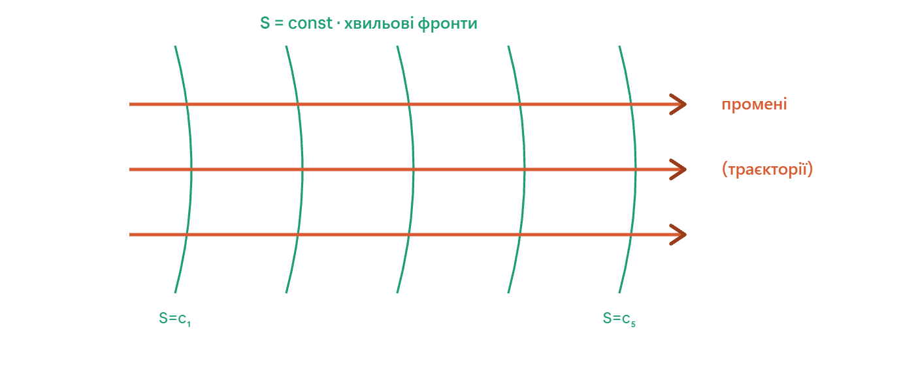

## 9. Рiвняння Гамiльтона-Якобi. Метод роздiлення змiнних.

### Ключова ідея

Рівняння Гамільтона-Якобі — це кульмінація аналітичної механіки. Метод полягає у пошуку такого ідеального канонічного перетворення, після якого новий Гамільтоніан системи тотожно дорівнюватиме нулю ($H' = 0$). У такому "порожньому" фазовому просторі нові координати та імпульси взагалі не змінюються з часом (залишаються константами). Вся складність задачі зводиться до знаходження твірної функції цього перетворення — **дії $S$**, яка є розв'язком одного диференціального рівняння в частинних похідних.

---

### Виведення рівняння Гамільтона-Якобі

Нехай ми хочемо знайти канонічне перетворення від $(q, p)$ до нових постійних змінних $(Q=\beta, P=\alpha)$. Використаємо твірну функцію другого типу, яка залежить від старих координат, нових імпульсів та часу: $F_2(q, P, t)$.

Ми знаємо зв'язки для $F_2$:

$$p_i = \frac{\partial F_2}{\partial q_i}$$

$$H' = H + \frac{\partial F_2}{\partial t}$$

Наша вимога: новий Гамільтоніан має дорівнювати нулю ($H' = 0$). Тоді друге рівняння набуває вигляду:

$$H(q_1, \dots, q_f, p_1, \dots, p_f, t) + \frac{\partial F_2}{\partial t} = 0$$

Оскільки твірна функція в цьому методі за змістом збігається з дією (як функцією координат і часу), її традиційно позначають через $S(q, \alpha, t)$. Підставивши $p_i = \frac{\partial S}{\partial q_i}$ у Гамільтоніан, отримуємо **рівняння Гамільтона-Якобі**:

$$H\left(q_1, \dots, q_f, \frac{\partial S}{\partial q_1}, \dots, \frac{\partial S}{\partial q_f}, t\right) + \frac{\partial S}{\partial t} = 0$$

Це нелінійне диференціальне рівняння першого порядку в частинних похідних відносно однієї функції $S$. Його розв'язок — повний інтеграл — має містити $f$ незалежних сталих інтегрування $\alpha_1, \dots, \alpha_f$ (нові імпульси) та ще одну адитивну сталу, яка не впливає на фізику.

### Алгоритм розв'язання задачі

1. **Запис рівняння:** Складаємо Гамільтоніан системи $H(q, p)$ і замінюємо в ньому всі імпульси $p_i$ на похідні $\frac{\partial S}{\partial q_i}$.
2. **Пошук дії S:** Розв'язуємо отримане рівняння і знаходимо повний інтеграл $S(q_1, \dots, q_f, \alpha_1, \dots, \alpha_f, t)$.
3. **Перехід до нових координат:** Знаходимо нові координати $\beta_i$ (які теж є константами) за формулою:

$$\beta_i = \frac{\partial S}{\partial \alpha_i}$$

4. **Отримання траєкторії:** Отримана система алгебраїчних рівнянь $\beta_i = \beta_i(q, \alpha, t)$ вже є готовим розв'язком! Залишається лише алгебраїчно виразити старі координати $q_i$ як функції часу та початкових умов: $q_i = q_i(\alpha, \beta, t)$.

### Метод розділення змінних

У більшості практичних задач розв'язати рівняння Гамільтона-Якобі в лоб неможливо. Тоді застосовують метод розділення змінних.

**Випадок 1: Розділення часу (консервативні системи)**
Якщо Гамільтоніан явно не залежить від часу ($\frac{\partial H}{\partial t} = 0$), дію можна подати як:

$$S(q, \alpha, t) = W(q, \alpha) - E t$$

де $E$ — повна енергія системи (одна зі сталих $\alpha$), а $W(q, \alpha)$ — **вкорочена дія**. Рівняння Гамільтона-Якобі спрощується:

$$H\left(q_i, \frac{\partial W}{\partial q_i}\right) = E$$

**Випадок 2: Повне розділення просторових координат**
Система називається такою, що допускає розділення змінних, якщо вкорочену дію $W$ можна подати як суму функцій, кожна з яких залежить лише від однієї координати:

$$W(q_1, \dots, q_f) = W_1(q_1) + W_2(q_2) + \dots + W_f(q_f)$$

Якщо таке представлення підставити в рівняння, воно розпадається на $f$ незалежних звичайних диференціальних рівнянь:

$$H_i\left(q_i, \frac{d W_i}{d q_i}\right) = \alpha_i$$

звідки кожна частина легко інтегрується: $W_i = \int p_i(q_i, \alpha) dq_i$.

---

### Підсумок

Рівняння Гамільтона-Якобі — це потужний метод, який замінює систему $2f$ звичайних диференціальних рівнянь (Гамільтона) одним диференціальним рівнянням у частинних похідних. Успіх застосування цього методу повністю залежить від можливості знайти таку систему координат (декартову, сферичну, циліндричну, параболічну тощо), в якій змінні рівняння розділяються. Цей формалізм також є прямим містком до квантової механіки (перехід до рівняння Шредінгера).

---

**Візуалізація: Хвильові фронти дії (оптико-механічна аналогія)**
Рівняння Гамільтона-Якобі математично ідентичне рівнянню поширення світлових хвиль в оптиці (рівнянню ейконала). У цій симуляції можна побачити, як "дія $S$" поширюється у просторі подібно до хвилі, а траєкторії частинок є "променями", перпендикулярними до цих хвильових фронтів. Це підкреслить глибоке розуміння теми твоїм сином.

---

Це **вершина** всієї цієї гори, найкрасивіша й найглибша формула класичної механіки. Ми весь час до неї дерлися: рівняння Гамільтона → канонічні перетворення → твірні функції. Тепер усе це збирається в одну ідею. Розпаковую так само повільно.

## Крок 1. Доводимо мрію до межі: а зробімо `H' = 0`

Пам'ятаєш, канонічним перетворенням ми хотіли зробити новий гамільтоніан простим. Найкращий випадок був — щоб `H'` залежав лише від `P`. А тепер питання-провокація: **а що, як зробити `H'` взагалі нулем?**

Дивись, що тоді кажуть рівняння Гамільтона:

$$\dot Q = \frac{\partial H'}{\partial P} = 0, \qquad \dot P = -\frac{\partial H'}{\partial Q} = 0$$

**І `Q`, і `P` стають просто константами.** Рух повністю «замерзає» — нові координати взагалі не змінюються з часом. Уся динаміка нікуди не поділась — вона захована **в самому перетворенні**. Лишилось одне: знайти ту твірну функцію, яка це робить.

## Крок 2. Рівняння Гамільтона–Якобі

Беремо твірну функцію типу `F₂(q, P)` і даємо їй спеціальне ім'я — `S`. Її називають **дією** (або головною функцією Гамільтона). Для `F₂` працюють правила (з минулої теми):

$$p = \frac{\partial S}{\partial q}, \qquad H' = H + \frac{\partial S}{\partial t}$$

Тепер просто вимагаємо `H' = 0`. Підставляємо в нього `p = ∂S/∂q` і отримуємо:

$$H\!\left(q,\ \frac{\partial S}{\partial q},\ t\right) + \frac{\partial S}{\partial t} = 0$$

Оце і є **рівняння Гамільтона–Якобі**. Словами рецепт такий: береш свій гамільтоніан, **скрізь замість `p` пишеш `∂S/∂q`**, додаєш `∂S/∂t` і прирівнюєш до нуля. Виходить одне рівняння (у частинних похідних) на одну функцію `S`.

У чому суть обміну: замість того щоб розв'язувати багато рівнянь руху, ти розв'язуєш **одне рівняння на `S`**. Знайшов `S` — і весь рух випадає простим диференціюванням.

## Крок 3. Що таке `S` — це «карта-господар»

Найважливіша інтуїція. Формула `p = ∂S/∂q` каже: **імпульс — це нахил функції `S`.** Тобто `S` — це наче рельєф, топографічна карта, а частинки «скочуються» по її схилах.

Тут є приголомшлива аналогія з **оптикою**. Уяви `S = const` як **хвильові фронти** (гребені хвилі), а траєкторії частинок — як **промені**, що завжди йдуть **перпендикулярно** до цих фронтів. Механіка тут виглядає точнісінько як поширення світла: одна функція `S` описує всю «хвилю» одразу, а кожна окрема частинка — це промінь цієї хвилі. Ось картинка:

Ця аналогія — не просто гарна. Це **буквально зерно квантової механіки**: у квантах частинка і є хвиля, фаза якої — це `S/ℏ`, а рівняння Гамільтона–Якобі виявляється класичною межею рівняння Шредінгера. Але це вже інша історія.

## Крок 4. Коли енергія зберігається — відриваємо час

Якщо `H` не залежить явно від часу (а це майже завжди в нас так — енергія зберігається), то час можна **відокремити** одразу. Шукаємо `S` у вигляді:

$$S(q, t) = W(q) - E\,t$$

Тут `E` — енергія (стала), а `W(q)` називають **характеристичною функцією Гамільтона**. Підставляємо: `∂S/∂t = −E`, і рівняння Гамільтона–Якобі стає вже без часу:

$$H\!\left(q,\ \frac{\partial W}{\partial q}\right) = E$$

Це **стаціонарне** рівняння Гамільтона–Якобі. А `E` — це наша перша **стала розділення** (вона ж — новий збережений імпульс `P`).

## Крок 5. Метод розділення змінних

Тепер найголовніша частина твого питання. Якщо в системі кілька координат `q₁, q₂, …`, пробуємо записати `W` як **суму доданків, кожен зі своєю координатою**:

$$W(q_1, q_2, \dots) = W_1(q_1) + W_2(q_2) + \dots$$

Якщо нам пощастило (точніше — якщо ми вдало вибрали координати), рівняння **розпадається**: кожен доданок залежить тільки від своєї змінної, і одне велике рівняння в частинних похідних розсипається на **кілька простих звичайних рівнянь** — по одному на координату.

І ось у чому золото: при кожному такому розділенні вискакує **своя стала** `α₁, α₂, …` — це й є **сталі розділення**. А кожна така стала — це **збережена величина** (новий імпульс `P`). Скільки в тебе ступенів свободи — стільки збережених величин ти отримуєш. А це означає, що система **повністю розв'язується** (зводиться до інтегралів).

Коротко: **розділення змінних працює тоді, коли координати підібрані під симетрію задачі.** Підібрати правильні координати — це і є мистецтво.

## Приклад 1: осцилятор через Гамільтона–Якобі

Швиденько, щоб ти побачив машину в дії на знайомій задачі. Стаціонарне рівняння:

$$\frac{1}{2m}\left(\frac{dW}{dq}\right)^2 + \frac{1}{2}m\omega^2 q^2 = E$$

Звідси `dW/dq = \sqrt{2mE - m^2\omega^2 q^2}`. Траєкторію дістаємо з правила `Q = ∂S/∂P = const`, де `P = E`:

$$t + \beta = \frac{\partial W}{\partial E} = \int\frac{m\,dq}{\sqrt{2mE - m^2\omega^2 q^2}} = \frac{1}{\omega}\arcsin\!\left(q\sqrt{\frac{m\omega^2}{2E}}\right)$$

Перевертаємо — і знову та сама синусоїда `q = \sqrt{2E/m\omega^2}\,\sin(\omega(t+\beta))`. Той самий результат, ще коротшим шляхом.

## Приклад 2: твій астрофізичний джекпот — задача Кеплера

А ось де ця тема стає твоїм хлібом. **Рух планети навколо зорі** (центральна сила) розділяється у **сферичних координатах** `(r, θ, φ)`. І сталі розділення, які при цьому випадають, — це:

- **`E`** — повна енергія,
- **`Lz`** — проєкція моменту імпульсу,
- **`L²`** — повний момент імпульсу.

Помічаєш? Це **рівно ті самі збережені величини**, що ми діставали з симетрій у темі про Нетер! Ось чому орбіти точно розв'язувані, а небесна механіка взагалі існує як точна наука. Коло замкнулось: симетрія → збережена величина → стала розділення → розв'язана орбіта.

## Велика картина

Розклади в голові так:

- Рівняння Гамільтона–Якобі — це **найглибше** формулювання класичної механіки: одне рівняння на дію `S`, з якого випадає весь рух.
- Метод розділення змінних — це **спосіб його розв'язати**, коли координати підібрані під симетрію; сталі розділення = збережені величини.
- І все це — **прямий місток у квантову механіку** (через `S/ℏ` до рівняння Шредінгера) і в небесну механіку (через орбіти).

Тобто ти зараз стоїш на точці, де класична механіка, симетрії та квантова фізика сходяться в одну формулу. Для астрофізика — must have.

---

# Рівняння Гамільтона–Якобі. Метод розділення змінних

**Шпаргалка на захист.** Одне рівняння на дію `S`, один рецепт розділення, два приклади (осцилятор + Кеплер).

---

## Ідея: канонічне перетворення до `H' = 0`

Шукаємо твірну функцію `F₂(q,P) ≡ S` (її звуть **дією**, або головною функцією Гамільтона), яка робить новий гамільтоніан **нулем**. Тоді:

$$\dot Q = \frac{\partial H'}{\partial P} = 0, \qquad \dot P = -\frac{\partial H'}{\partial Q} = 0$$

— і `Q, P` стають сталими. Весь рух «заморожується»; динаміка захована в самому перетворенні `S`.

---

## Рівняння Гамільтона–Якобі

Для `F₂` маємо `p = ∂S/∂q` і `H' = H + ∂S/∂t`. Вимога `H' = 0` дає:

$$\boxed{\,H\!\left(q,\ \frac{\partial S}{\partial q},\ t\right) + \frac{\partial S}{\partial t} = 0\,}$$

**Рецепт:** у гамільтоніані скрізь заміни `p → ∂S/∂q`, додай `∂S/∂t`, прирівняй до нуля. Одне рівняння в частинних похідних на одну функцію `S`. Знайшов `S` — увесь рух випадає диференціюванням.

**Зміст `S`:** `p = ∂S/∂q` означає, що імпульс — це нахил дії. `S = const` — хвильові фронти, траєкторії — промені ⟂ до них (механіка = «оптика матерії»; зерно квантовки через `S/ℏ` → рівняння Шредінгера).

---

## Стаціонарний випадок (енергія зберігається)

Якщо `H` не залежить явно від `t`, відриваємо час:

$$S(q,t) = W(q) - E\,t$$

`W` — **характеристична функція**, `E` — енергія (перша стала розділення). Рівняння стає без часу:

$$H\!\left(q,\ \frac{\partial W}{\partial q}\right) = E$$

---

## Метод розділення змінних

Для кількох координат пробуємо суму:

$$W(q_1, q_2, \dots) = W_1(q_1) + W_2(q_2) + \dots$$

Якщо координати вдало підібрані під симетрію, рівняння **розпадається** на окремі звичайні рівняння — по одному на координату. При кожному розділенні з'являється **стала розділення** `α₁, α₂, …` — це збережені величини (нові імпульси `P`).

`N` ступенів свободи → `N` сталих → система **повністю інтегровна** (зводиться до квадратур). Працює тоді й тільки тоді, коли координати узгоджені з симетрією задачі.

---

## Приклад 1: гармонічний осцилятор

Стаціонарне рівняння ГЯ:

$$\frac{1}{2m}\left(\frac{dW}{dq}\right)^2 + \frac{1}{2}m\omega^2 q^2 = E \;\Rightarrow\; \frac{dW}{dq} = \sqrt{2mE - m^2\omega^2 q^2}$$

Траєкторія з `t + \beta = \partial W/\partial E`:

$$t + \beta = \int\frac{m\,dq}{\sqrt{2mE - m^2\omega^2 q^2}} = \frac{1}{\omega}\arcsin\!\left(q\sqrt{\tfrac{m\omega^2}{2E}}\right)$$

$$\Rightarrow\; q(t) = \sqrt{\tfrac{2E}{m\omega^2}}\,\sin\big(\omega(t+\beta)\big)$$

---

## Приклад 2: задача Кеплера (центральна сила)

Розділяється у **сферичних координатах** `(r, θ, φ)`. Сталі розділення:

- `E` — повна енергія,
- `L_z` — проєкція моменту імпульсу,
- `L²` — повний момент імпульсу.

Це **ті самі збережені величини, що випливають із симетрій** (теорема Нетер). Тому орбіти точно розв'язувані — фундамент небесної механіки.

> **Стрижень усіх трьох тем:** симетрія → збережена величина → стала розділення → розв'язана орбіта.

---

## Фрази для захисту (вивчити дослівно)

- «Рівняння Гамільтона–Якобі — це умова, що канонічне перетворення робить новий гамільтоніан нулем; `H(q, ∂S/∂q, t) + ∂S/∂t = 0`.»
- «`S` — це дія, твірна функція типу `F₂`; її градієнт дає імпульс: `p = ∂S/∂q`.»
- «Якщо `H` не залежить від часу, `S = W − Et`, і рівняння стає `H(q, ∂W/∂q) = E`.»
- «Метод розділення змінних: `W = ΣWᵢ(qᵢ)`; кожна стала розділення — збережена величина, `N` сталих повністю розв'язують систему.»
- «Класичний приклад розділення — задача Кеплера у сферичних координатах зі сталими `E`, `L_z`, `L²`.»

---

_Якщо панікуєш: ГЯ = «заміни `p` на `∂S/∂q` і прирівняй до нуля». Розділення = «розклади `W` у суму по координатах, лови сталі». Кеплер закриває прохання про приклад._
